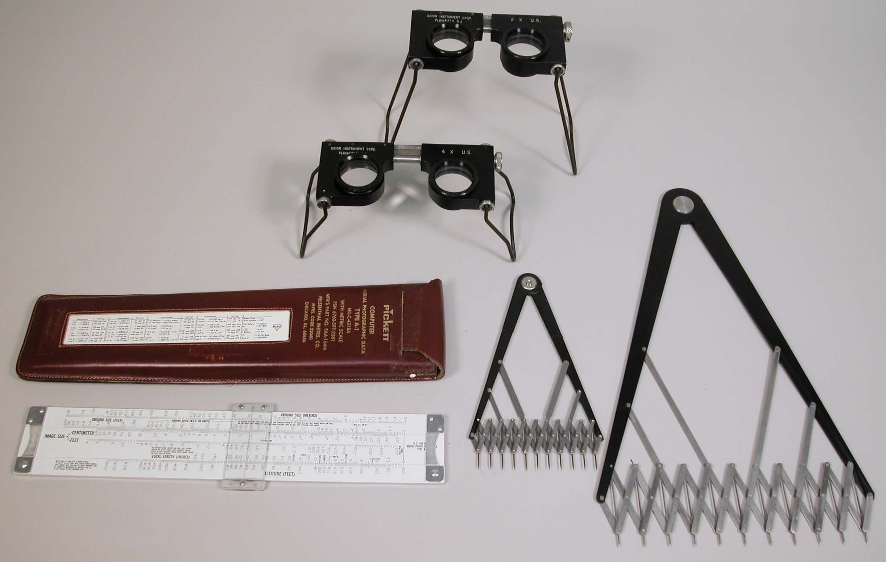
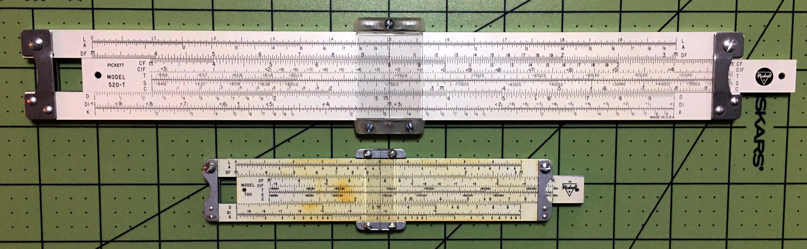
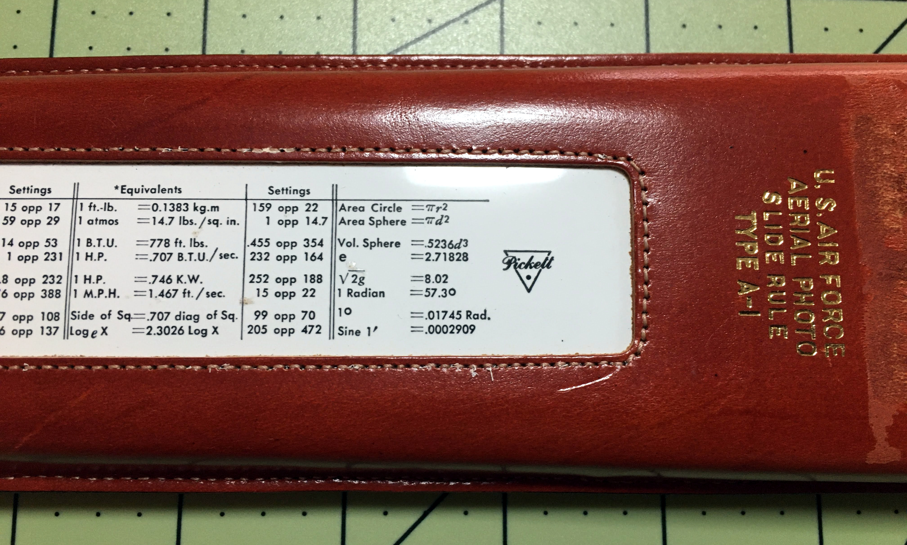

# Pickett United States Air Force Aerial Photography Slide Rules
## Eric Rinehart

**FIGURE 1. Pickett Models 520 & 700**

In 2020, as I began to take an interest in slide rules, I started to
look at slide rules on eBay. Before long, I found a rule called an
“Aerial Photography Slide Rule.” The rule was a Pickett Model 700
(Figure 1), an aluminum pocket-sized slide rule with standard scales on
one side. On the other side, it had scales with interesting labels like
“Altitude,” “Focal Length,” and “Image Size.” The specialized design and
apparent purpose of the rule piqued my curiosity, so I ordered it.

A few days later, I marveled at the little aluminum jewel in my hands.
As I studied it, I began to wonder exactly what problems it was designed
to solve. How did its designers decide on the range of values for its
aerial photo scales? What about the scales on the rule’s “rear”?

The first source of information I found about the rule was its operating
manual, which I found on the International Slide Rule Museum web site.
The manual described the rule’s basic operation, and some of the
philosophy behind its design. The manual also told me that the rule was
designed by Amrom H. Katz. Interestingly, it also refers the reader to
an article written by Katz in a journal called *Photogrammetric
Engineering*: “Contributions to the theory and mechanics of
photo-interpretation from vertical and oblique photographs.”
1

I liked the Model 700 so much that I found and purchased its big
brother, the Model 520, also from eBay. This rule came with its
cardboard box, leather case, and original manual.

As I searched for more information about these Aerial Photo Slide Rules,
I stumbled upon Nathan Zeldes’s article “A Calculator Hidden in a
Book”2 about a different device designed to solve a similar
problem. Zeldes’s curiosity and exploration of the Cornell “How Many?”
device, along with his mention of the Pickett Model 700, inspired me to
research further and to consider writing an article of my own.

Katz’s article took me a while to find, but I did eventually find it in
*Photogrammetric Engineering*. Reading it, and other articles Katz wrote
for the Rand Corporation, gave me an appreciation for the man’s writing
style and insight to problems of aerial photography.

### What Is the Pickett Model 700 For?

The Aerial Photo Slide Rule was designed primarily to calculate the
representative fraction, or scale, of aerial reconnaissance photographs.
The representative fraction is the ratio of the focal length of the
camera to the altitude from which the photo is taken. See Figure 2.

One example from the Model 520/700 manual is that of a photograph taken
with a camera with 36-inch focal length from an aircraft flown at 30,000
feet altitude. The representative fraction for that photograph is
3':30,000', or 1:10,000. From there, other information about a
photograph can be extrapolated, such as the size of objects on the
ground, and distances between them.

These problems are just proportions. Proportions are right in a slide
rule’s wheelhouse.

**FIGURE 2. Representative Fraction**

The British Royal Air Force had published a set of tables of
representative fractions, image sizes, and resulting ground object sizes
for aerial photography interpreters. First, the Photo-interpreter had to
calculate the representative fraction manually, then look up the image
and ground object sizes in the tables. These tables had many thousands
of entries (maybe millions?) and were cumbersome.

Before designing the Aerial Photo Slide Rule, Katz constructed a
nomograph to help solve representative fractions, but he soon found that
“even a nomograph is somewhat clumsy to use.”1 So he
constructed an experimental Aerial Photo Slide Rule.

The article shows photos of an early version of the Aerial Photo Slide
Rule, constructed from “inexpensive vinyl plastic.”1 This
rule’s altitude scale only goes up to 60,000 feet, and its focal length
scale only to 100 inches. Otherwise, its design is similar to the
finished product that appears on the Pickett Aerial Photo Slide Rule.

### Altitude

The next question that came to my mind was, “How did Katz arrive at a
maximum altitude of 250,000 feet?” As it appeared this rule would have
been designed around 1950, what aircraft would have been used for aerial
photo reconnaissance? This question by itself captured my imagination
for a few weeks, searching for aircraft and aerial reconnaissance
practices in late World War II through the early Fifties.

The first aircraft I thought of were the U-2 and A-12 / SR-71, which
were still years away from their introductions in 1950. Even if the
aerial reconnaissance rule were designed with those future aircraft in
mind, the maximum altitudes of the U-2 and SR-71 are 70,000 feet and
85,000 feet respectively, depending on your source of information.

Orbital spy satellites were still several years off in 1950. Sputnik did
not orbit the Earth until 1957, and the perigee of its orbit was over
700,000 feet, so that altitude does not work either.

Maybe a sub-orbital platform launched via rocket? The most likely
example of this would be the German V-2 rocket. The maximum altitude of
the V-2 was around 291,000'. I found one photo taken from a V-2, but no
evidence that they were commonly used for this purpose, either by the
Germans or Americans.

What about a balloon? I found information about a “Project Genetrix,”
but it seems the maximum altitude for that project was about 100,000'.

I found an interesting web site called Air Recce3 that shares
information about aerial reconnaissance as it was done during World War
II. This was exactly what I needed.

Air Recce and Wikipedia both seem to show that the aircraft used most
for aerial reconnaissance during and just after World War II were
versions of the North American P-51 Mustang known as the F-6, and the
Lockheed P-38 Lightning known as the F-4 and F-5. The F-4 and F-5,
“...as a reconnaissance aircraft, obtained 90 percent of the aerial film
captured over Europe.”4 Both of these aircraft could fly over
40,000 feet. Many of the examples in the Model 520/700 manual use an
altitude of 30,000 to 40,000 feet, so it seems likely this is what Katz
had in mind.

Also of interest is the RB-36D, a Photo Reconnaissance version of the
Convair B-36 Peacemaker. This aircraft could fly above 50,000 feet,
could carry multiple cameras, and had a long range. The RB-36D becomes
important in the discussion about aerial reconnaissance cameras.

I seemed no closer to finding the answer to my question: why a maximum
of 250,000 feet?

I finally found the answer in Katz’s article in *Photogrammetric
Engineering*: “…to permit the use of this slide rule in *oblique
photography* computations.”1 (emphasis mine)

The Model 520/700 manual states that “the problems associated with
oblique photography are much more difficult than the corresponding
problems in vertical photography” and that “This slide rule can be used
in conjunction with other aids for oblique photography; these are now
under development….”

Katz’s article in *Photogrammetric Engineering* discusses these “other
aids.”1 The Smithsonian National Air and Space Museum has a
prototype, dated 1949, designed and donated by Katz.5
See Figure 3.

**FIGURE 3. Calculator, Graphic, Oblique, Aerial Type A-1, Prototype, with 18 Transectors,**

**Smithsonian Air and Space Museum, Photographer: Carl J. Bobrow**

### Focal Length

“Why a maximum focal length of 240 inches?” I found the answer to this
question as I was researching likely aircraft. In his article, Katz
mentions the K-24 and other cameras with a focal length from 24 to 36
inches. These were often carried by the F-5 and F-6, and Katz refers to
them in examples in his article.1

However, while reading about the RB-36D, I read that it could be
equipped with something called the “Boston Camera.” The Boston Camera
had a focal length of 240 inches, and: “a photo interpreter could detect
a golf ball from an altitude of 45,000 feet (14,000 m).”6

The Boston Camera was not manufactured until 1951, and was used
sparingly. The Boston Camera may not have been used frequently because
it was sensitive to aircraft vibration.7 Cameras with 24- to
36-inch focal lengths were much more common.

The Pickett Model 520/700 has gauge marks for what are probably common
focal lengths: 24 inch, 36 inch, 48 inch, 72 inch, 96 inch, and 144
inch.

### Ground Speed

The ground speed scale is used to calculate image speed and cycling
time.

The ground speed scale reads up to 1,000 Miles per Hour / Knots. I did
not find any aircraft likely to be used for aerial reconnaissance around
1950 with such a high top speed. I would suppose that 1,000 Miles per
Hour was a “nice, round figure” that allowed for future developments.

The ground speed scale on the rule is used to calculate “image speed”
arising from forward aircraft speed. After aligning the “M.P.H.” mark
with the representative fraction, setting the cursor to the “ground
speed” will show the image speed in Inches Per Second.

The Aerial Photo rule can be used to calculate cycling time between
exposures, how many exposures are required to survey a given area, the
required altitude to photograph an object of a given ground size at a
desired image size, and a minimum altitude given a flight speed and
requirement for sixty percent image overlap on a given size of film. A
sixty percent overlap in adjacent photos produces stereoscopic aerial
views.

**FIGURE 4. Kit, Photo Interpretation, Felsenthal, Type BS 9A, partial,**

**Smithsonian Air and Space Museum, Photographer: Carl J. Bobrow**

This photo interpretation kit (Figure 4) includes a Pickett 52T Type-A1
Aerial Photography Slide Rule, two different Magnifying Stereoscopes,
and Proportional Dividers.8 The 52T varies from the Model 520
/ 700 by including a “Ground Size Meters” scale in addition to the
Ground Size Feet scale.

### Rule Orientation

In our correspondence, Jim Bready noted to me that when switching from
one side of the rule to the other, on most rules, you would rotate the
rule along its long axis, and the rule is still oriented correctly.
However, the Aerial Photography Rule seems to be set up to flip
end-for-end to switch sides of the rule. Jim pointed out that that seems
to be the case for all of the different makes of aerial photography
rules that he has. I had noticed the same thing, though I had not given
it much thought until then.

Page eight of the manual states, “When the Aerial Photo side of the
slide rule is used, the rule must be held vertically.”

I have found that when the rule is held vertically for Aerial Photo use, in the left hand, palm up,
switching to the “rear” of the rule is easy to accomplish by rolling the
left wrist to the right, presenting the rear of the rule in its correct
orientation. See Figure 5. I think this is how the rule is meant to be
used.

**FIGURE 5. Transition from Front to Rear Scales of the Pickett Model 700**

### Precision & Accuracy

I wondered about whether the calculations done with the rule would be
precise and accurate enough to provide useful intelligence for the photo
interpreter. Katz addresses the question of Precision and Accuracy in
his article in *PHOTOGRAMMETRIC ENGINEERING*:

> Briefly stated, precision refers to the reproducibility of the
> measurement operation, whereas accuracy refers to the essential truth
> of the measurement, i.e. its nearness to the true value.1
>
> It is a serious and pernicious fallacy to believe that because
> computations are made with a modern electric calculator, "answers" can
> be written down embodying all the figures cast up by the machinations
> of the calculator.1

Katz expands on this topic in some of his other articles.

First, the photo interpreter does not need to find the dimensions of a
ground object down to fractions of an inch. The question is one of
whether the object on the ground is a foxhole, a missile launch site, or
an airfield, for example (as noted in *Some Notes on the History of
Aerial Reconnaissance).*9

Second, there are other sources of error in the process of obtaining the
aerial photographs. These sources include whether the film lies flat in
the camera, the motion of the shutter with respect to the airplane’s
path, errors in measurement of the airplane’s altitude, errors in the
stated focal length of the camera, and whether the photo is actually
vertical. Katz states1 that these errors can be as much as
10%, whereas the “Ground Size” scale can be read within 0.1% on the 10"
rule. So, the Aerial Photography rule provides plenty of accuracy for
the job at hand.

### Rear of the Rule

Katz made a recommendation about what scales should be on the “rear” of
the Aerial Photography rule: “The reverse side of the rule will be a
newly arranged standard 10 inch rule, having the normal, folded and
inverted scales (C, D, CF, DF, DIF, DI), the square and cube scales (A &
K), the sine and tangent scales (S & T), and the log scale
(L).”1

The scale set on the “rear” of the 520 is the same as that of the 700.
See Figure 6.  

**FIGURE 6. Rear of Pickett Models 520 & 700**

Pickett’s selection of scales for the “rear” of the Model 520/700 is
close to Katz’s recommendation: **L, A, DF \| CF, CIF, T, S, C \| D, DI,
K.**

Jim Bready shared images of some Aerial Photography rules that he has,
and the BRL 54 aerial photo rule has the following scales on its rear:
**S&T, A \| B, S, T, C \| D.**

So, it appears that there is no “standard” for the scales on the rear of
the aerial photography rule, but Pickett’s rules seem to reflect the
scale set that Katz had in mind.

I wondered if it would make sense to have an ST scale to calculate small
angles for “slightly oblique” aerial photos. Or maybe other scales for
triangles with small apex angles, like the scales of the Model 14
Artillery rule?

I was also curious about the inclusion of the CIF scale rather than the
more-common CI scale. Certainly, the CIF scale can be used in the same
way as CI, but I would like to know more about this choice.

I found some insight into these scale selections while perusing Pickett
Slide Rule catalogs on the International Slide Rule Museum. The 1954
*Pickett All-Metal Slide Rules Catalog 164-A*10 includes not
only the Model 520 and 700 “U.S.A.F. AERIAL PHOTO SLIDE RULES,” but also
a Model 706-S.

The Model 706-S is a rule with the same scale set as the “rear” of the
Model 700 on the front, and the rear is blank. The 164-A catalog calls
the scale set a “*complete* Trig Scale arrangement all on one side of
the rule - available only on Pickett Pocket Rules”. The catalog markets
the 706-S with “Your Imprint On Rule And Case,” with your company’s
product or trade mark on the rear of the rule; or as a “Special
Conversion Rule,” with your company’s own conversion factors on the rear
of the rule.

So, the Model 700 appears to be a “Special Conversion Rule,” but this
does not answer the question “which came first, the 700, or the 706-S?”

Pickett did produce a “Full Size Special Conversion Rule.” However, the
Special Conversion Rule is the 903-S, which has a different, though
similar, scale set from the 520/700: **K A DF \| CF T S CI C \| D L.**

### The Case

Another unique feature of the Model 520/700 is the case. For each of the
rules, its case is the standard Pickett leather case for its size, but
with a table of equivalents and settings for conversion factors set into
a window added to the case.

**FIGURE 7. Closeup of Pickett Model 520 Case**

### Conclusion

As a tool designed to solve an interesting problem, and as a cold war
artifact, the USAF Aerial Photo Slide Rule is an interesting addition to
my slide rule collection. Exploring its origins has been fun, and I find
this aspect of the slide rule hobby one of the most enjoyable. I hope
this exploration has been enjoyable for you as well.

### Acknowledgments

I wish to thank my wife Alyssa for her encouragement and proofreading,
Jim Bready for his encouragement and assistance, Nathan Zeldes for
inspiration, and Michael Konshak for the wonderful resource that is the
International Slide Rule Museum.

I also wish to thank the Smithsonian Air and Space Museum for their
permission to use images from their collection in this article.

### Notes

1.  Katz, Amrom H., Contributions to the theory and mechanics of
photo-interpretation from vertical and oblique photographs,
*PHOTOGRAMMETRIC ENGINEERING*, June 1950. © 1950 American Society for
Photogrammetry and Remote Sensing.  
<https://www.asprs.org/wp-content/uploads/pers/1950journal/jun/1950_jun_339-386.pdf>

2.  Nathan Zeldes, *A Calculator Hidden in a Book,*
<https://www.nzeldes.com/HOC/Cornell.htm>

3.  Air Recce website:  
<https://web.archive.org/web/20120525063736/http://www.airrecce.co.uk/WW2/recce_ac/USAR.html>

4.  <https://www.lockheedmartin.com/en-us/news/features/history/p-38.html>

5.   Calculator, Graphic, Oblique, Aerial Type A-1, Prototype, with 18
Transectors  
<https://www.si.edu/object/calculator-graphic-oblique-aerial-type-1-prototype-18-transectors:nasm_A19930313000>

6.  K-42 “Boston Camera”: <https://en.wikipedia.org/wiki/Boston_Camera>

7.  The CIA and the U-2 Program, 1954-1974, pages 54 & 55, “C camera”:  
<https://www.cia.gov/static/37e56c57ddf41f9c85f357a04900e1e8/CIA-and-U2-Program.pdf>

8.  Kit, Photo Interpretation, Felsenthal, Type BS-9A, partial:  
<https://www.si.edu/object/kit-photo-interpretation-felsenthal-type-bs-9a-partial:nasm_A19771915000>

9.  Thad Jones, *Interpretation Of Military Installations From Aerial
Photographs* PHOTOGRAMMETRIC ENGINEERING, Vol. 14 No.4, December 1948
pp.502-503 © 1948 American Society for Photogrammetry and Remote
Sensing  
<https://www.asprs.org/wp-content/uploads/pers/1948journal/dec/1948_dec_496-506.pdf>

10.  Pickett All-Metal Slide Rules Catalog 164-A:  
<https://sliderulemuseum.com/Manuals/Pickett_Catalog_1954.pdf>
