
# My Slide Rules

## Table of Contents

In Order of Acquisition

* [Concise Model CTCS-552](#concise552)
* [Pickett 902-T Simplex Trig](#pickett902)
* [Roos Company No. SR-109](#roos109)
* [Pickett Model 700 A-2](#pickett700)
* [Pickett Model 520 A-1](#pickett520)
* [Aristo 0903LL Scholar](#aristo09903ll)
* [Aristo 867U Darmstadt](#aristo867u)
* [Pickett N4-ES](#pickettn4)
* [KL-1 Circular Slide Rule](#kl1)
* [Frederick Post 1457 Mannheim Trig](#post1457)
* [Sun Hemmi No. 130 System Darmstadt](#hemmi130)
* [Pickett Model 200](#pickett200)
* [K&E N4058W Beginner’s Slide Rule](#ke4058)
* [Pickett Model N14 ES Military Ranging](#pickett14)
* [Pickett Model 500 Ortho Phase Log Log](#pickett500)
* [Pickett Model N200-T Trig](#pickettN200T)
* [Pickett Model 300](#pickett300)
* [Pickett Model 600](#pickett600)
* [Pickett Model 1000 Ortho-Phase Duplex](#pickett1000)
* [Pickett Model 1006 Duplex Trig](#pickett1006)

## Wish List

* [Pickett Model 100 “Douglas Sky Rule”](#pickett100)
* [Pickett Model 400 Business Rule](#pickett400)
* [Concise Model 270](#concise270)
* [Concise Model 300](#concise300)

All photos ©2022 A. E. Rinehart unless otherwise noted.

-----

## Concise Model CTCS-552
[Concise Page on ISRM](https://www.sliderulemuseum.com/Concise.htm)

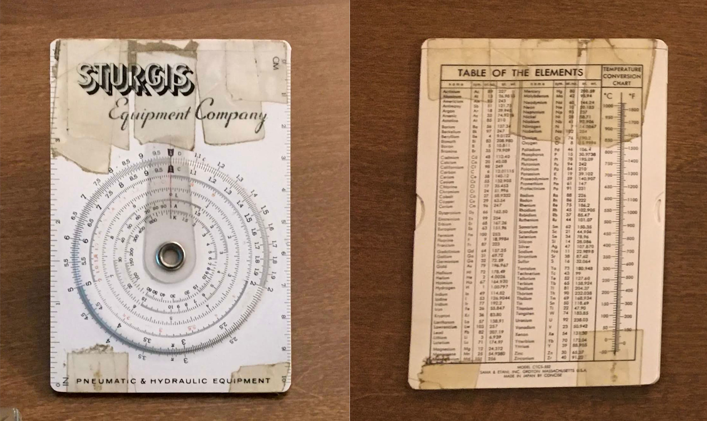

* From Dad, 1976?
* Scales: 4in || D ( C, CI, L, A, K) || 10cm
* Table of the Elements and Temperature Conversion Chart on back
* Insert ©1966
    * Length, Area, Weight, Volume, Decimal Equivalents, Velocity, Gas Constants, Flow Rate, Energy, Pressure, Useful Constants
* Includes manual
    * Manual © 1967
* Includes red vinyl case
* Imprinted "Sturgis Equipment Company"
* Poor condition, but complete and functional. Taped together.
    * I played with it like a toy and left it exposed to sunlight in a window sill. If I remember correctly, the sunlight is what hurt it worst.
* **Update:** When Dad visited in December 2021, I showed him my collection and told him I got this Concise from him.
He said he didn't remember it.
In fact, his slide rule was a yellow pocket-size Pickett!
He said he liked Picketts because they were “built like tanks” and did anyone else even make slide rules?
He forgot which model he had, though.

[Return to Top](#top)

-----

## Pickett 902 Simplex Trig
### [Pickett Page on ISRM](https://www.sliderulemuseum.com/Pickett.htm)
### [Pickett Reference Image on ISRM](https://www.sliderulemuseum.com/Manuals/Pickett_Chronology.jpg)
### [Just like this one on Greg's Slide Rules](http://sliderule.ozmanor.com/rules/sr-0128-pick902t-01.html)

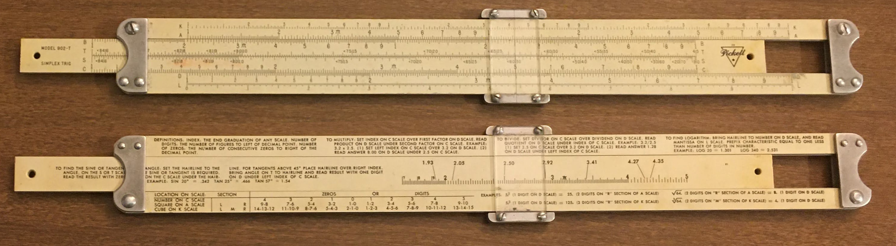

* Lys got me this!
    * Lot of two (with Roos SR-109 below) for ~$20
    * ~2010?
* [Pickett Metal Slide Rules Chronology](https://osgalleries.org/journal/displayarticle.cgi?match=1.1/V1.1P5.pdf)
* [Pickett Metal Slide Rules - A Brief Update](https://osgalleries.org/journal/displayarticle.cgi?match=3.2/V3.2P47a.pdf)
* Manufactured 1955 - 1957
    * Aluminum
        * Shiny edges, not corroded or dark
        * 1953 or Later: Transition from Magnesium to Aluminum occurred in 1953 (?)
    * "Period 3"
    * Logo Style 3
        * "39" Above Logo
    * Stamped Aluminum Posts
        * "Smooth Stamped Posts Contoured to Finger Tip"
    * Plain Flat Lens
    * Machined Metal Cursor Bars
    * Grooved Rails
    * Grooved Slide
    * Slide Tension Springs
    * Slide Reverse has "41" artwork mark, no copyright mark.
    * Scales
        * Front: K, A [B, T, S, C] D, L
        * Rear: Instructions
* Good condition

[Return to Top](#top)

-----

## Roos Company No. SR-109
### [Charvoz-Roos Page on ISRM](https://www.sliderulemuseum.com/CharvozRoos.htm)

* Lys got me this!
    * Lot of two (with Pickett 902-T above) for ~$20
    * ~2010?

* Manufactured 1941 - 1946, probably 1945
    * Made by The Roos Company prior to Charvoz-Roos merger (1946)
    * Material: Wood stock with plastic laminate, plastic end pieces
* Scales:
    * Front Scale: T, DF [ CF, CIF, CI, C ] D, S, ST
    * Back Scale: Conversions [ B, K, L, C ] Trig Identities
* Includes "MANNHEIM-TRIG" manual
    * Manual © 1945
    * Manual is from Acu-Rule
* Fair condition. Plastic on slide delaminating from wood slightly at ends.
* Includes leatherette case
    * No markings on case
        * This seems to be the same size and design as the case that came with the [Post 1457](#post1457), except with smooth leather
    * Flap torn off
        * When I got it, the flap wasn't torn off yet, but it was close
    * Written inside flap:
        * "Mrs. J. S. Payte 322 Dennis St. Nacodoches Texas"
* Compare to [Frederick Post 1457 Mannheim Trig](https://www.sliderulemuseum.com/Post/S076_Post_1457.jpg) ISRM S076
* Also compare to [Frederick Post 1457](#post1457) below.

[Return to Top](#top)

-----

## Pickett Model 700 A-2
### "U. S. AIR FORCE AERIAL PHOTO SLIDE RULE TYPE A-2"
### [Pickett Page on ISRM](https://www.sliderulemuseum.com/Pickett.htm)

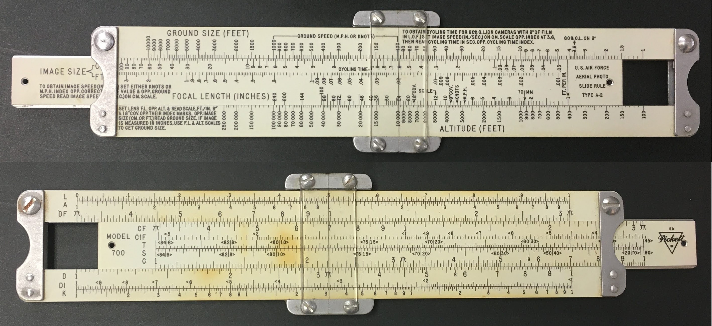

* Purchased June 12, 2020
    * Ebay
    * $32 Shipped
* [Manual](https://www.sliderulemuseum.com/Manuals/M184_P232_Pickett_USAF_AerialPhoto_M520-700.pdf)
    * Working on a better copy: I am performing OCR and Proofreading on [this older version of the manual found on this page](http://sliderule.ozmanor.com/man/man-download.html)
* [Pickett Metal Slide Rules Chronology](https://osgalleries.org/journal/displayarticle.cgi?match=1.1/V1.1P5.pdf)
* [Pickett Metal Slide Rules - A Brief Update](https://osgalleries.org/journal/displayarticle.cgi?match=3.2/V3.2P47a.pdf)
* Manufactured Early 1950s
    * Aluminum
        * Shiny edges, not corroded or dark
        * 1953 or Later: Transition from Magnesium to Aluminum occurred in 1953 (?)
    * Documentation states that Aerial Photo Slide Rule is "Front" and Slide Rule Scales are "Reverse"
    * Scales:
        * Front: Ground Size (Feet), Image Size (CM, FT), Focal Length (Inches), Altitude (Feet)
        * Rear: L, A DF [ CF, CIF, T, S, C ] D, DI, K
    * Logo Style 3
        * "59" Above Logo
    * Stamped Aluminum Posts
        * "Smooth Stamped Posts Contoured to Finger Tip"
    * Plain Flat Lens
    * Machined Metal Cursor Bars
    * Grooved Rails
    * Male Slide
    * No Slide Tension Springs
* Includes Case with Conversions and Formulas and pocket clip
* Good condition.

[Return to Top](#top)

-----

## Pickett Model 520 A-1
### "U. S. AIR FORCE AERIAL PHOTO SLIDE RULE TYPE A-1"
### [Pickett Page on ISRM](https://www.sliderulemuseum.com/Pickett.htm)
### 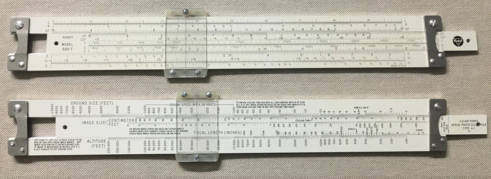

* Purchased June 25, 2020
    * Ebay
    * $48 Shipped
* [Manual](https://www.sliderulemuseum.com/Manuals/M184_P232_Pickett_USAF_AerialPhoto_M520-700.pdf)
* [Pickett Metal Slide Rules Chronology](https://osgalleries.org/journal/displayarticle.cgi?match=1.1/V1.1P5.pdf)
* [Pickett Metal Slide Rules - A Brief Update](https://osgalleries.org/journal/displayarticle.cgi?match=3.2/V3.2P47a.pdf)
* Manufactured 1962 - 1966
    * Aluminum
        * Shiny edges, not corroded or dark
    * Documentation states that Aerial Photo Slide Rule is "Front" and Slide Rule Scales are "Reverse"
    * Scales:
        * Front: Ground Size (Feet), Image Size (CM, FT), Focal Length (Inches), Altitude (Feet)
        * Rear: L, A DF [ CF, CIF, T, S, C ] D, DI, K
    * Logo Style 4
        * No Artwork Mark
        * No Copyright Mark
    * Stamped Aluminum Posts
        * "Grooved Stamped Posts Contoured to Finger Tip"
    * Grooved Convex Lens
    * Nylon Cursor Bars
    * No Grooves in Rails for Cursor
    * Grooved Slide
    * Slide Tension Springs
    * Slide Aerial Photo side has "57" artwork mark, no copyright mark.
* Includes Original Box
* Includes Case with Conversions and Formulas
    * Leather case with plastic insert.
    * Appears that the case used to have a "DYMO Embosser" label applied. Cannot read what it said.
* Includes Instruction Manual
* Includes "Slide Rule Guarantee Registration Card"
    * Serial Number 209763
* Excellent Condition

[Return to Top](#top)

---

## Aristo 0903LL Scholar
### [Aristo Page on ISRM](https://www.sliderulemuseum.com/Aristo.htm)

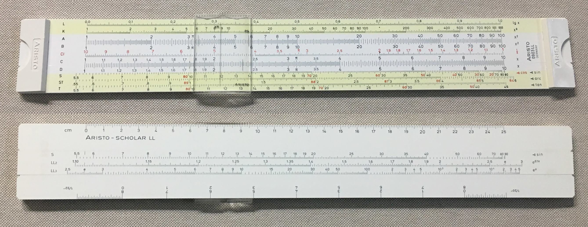

* Purchased July 8, 2020
    * Ebay
    * $19.25 Shipped
    * Arrived July 12, 2020
* [Manual](https://www.sliderulemuseum.com/Manuals/ISRM_M316_Aristo_Scholar_0903LL_VS-2_GiftOfEdwardWright.pdf)
* Scales:
    * Front: L, K, A [ B, CI, C ] D, S, ST, T
    * Rear: 25cm [ S, LL2, LL3] 8 inch(bi-directional)
* Convex Plastic Cursor
* Manufacturing Code "3LR28"
    * 1971
    * Geretsried
    * Lot 28
* Includes Plastic Box
    * “Dieter Engel…” written in pencil
* Excellent Condition

[Return to Top](#top)

---

## Aristo 867U Darmstadt
### [Aristo Page on ISRM](https://www.sliderulemuseum.com/Aristo.htm)

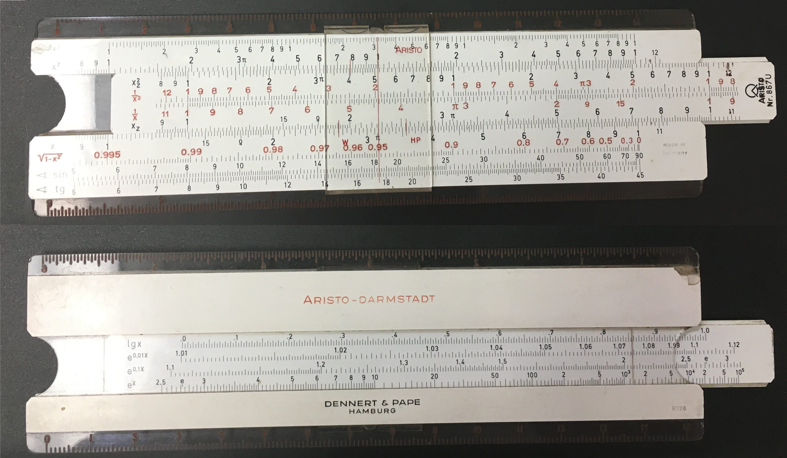

* Purchased July 19, 2020
    * Ebay
    * $17.12 Shipped
    * Arrived July 24, 2020
* Scales:
    * Front: K, A [B, BI, CI, C] D, P, S, T
        * x³, x² [ x², 1/x², 1/x, x ] x, √(1-x²), sin, tg
        * Top: Transparent Centimeter Scale
        * Bottom: Transparent Inch Scale
    * Rear: [L, LL1, LL2, LL3]
        * [lg x, e^0.01x, e^0.1x, e^x]
        * Aristo-Darmstadt
        * Dennert & Pape Hamburg
        * "5328" Date Code Stamp
        * Clear back over slide with hairlines at indexes
* Plastic Cursor
    * W & HP hairlines
* Includes Leather Case
    * Worn but functional
    * Stamped "ARISTO MADE IN GERMANY"
* Manufacturing Code Stamp "5328"
    * Not the later alphanumeric Aristo date code
    * Oughtred Society Journal Article: [DENNERT & PAPE and ARISTO Slide Rules 1872 - 1978](https://osgalleries.org/journal/displayarticle.cgi?match=6.1/V6.1P4.pdf)
    * Old enough to have the "circle and angle" symbol at the right end of the scale, Figure 16 in the above article, which supposedly ended in 1952, with "Nr. 867U" catalog number.
    * 1953, Lot 28
* Good Condition
    * Crack in body at left end of K scale
    * Broken plastic on back

[Return to Top](#top)

---

## Pickett N4-ES
### [Pickett Page on ISRM](https://www.sliderulemuseum.com/Pickett.htm)
### [Pickett Reference Image on ISRM](https://www.sliderulemuseum.com/Manuals/Pickett_Chronology.jpg)

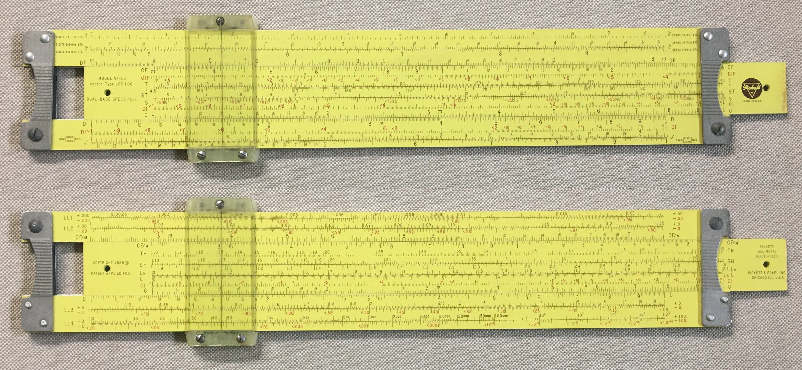

* [Manual on ISRM Site](https://www.sliderulemuseum.com/Manuals/M76_Pickett_HowToUseLogLogSR_1953.pdf)
…or at least the only one I could find that discusses the TWO Tangent scales
* Purchased September 24, 2020
    * Ebay
    * $42.70 Shipped
    * Arrived October 1, 2020
* Scales
    * Front: LL1+.00D/-.00D, LL2+.0D/-.0D, DF/m [ CF/m, TH, SH, Ln, L, CI, C ] D, LL3+.D/-.D, LL4+D./-D.
    * Rear: ∛ #1, ∛ #2, ∛ #3, DF [ CF, CIF, T1, T2, ST, S Cos,  CI, C ] D, DI, √ #1, √  #2
* Manufactured 1962 - 1964
    * Aluminum
    * Logo Style 4
        * No Artwork Mark
        * “MADE IN U.S.A.” under logo like Style 5
    * Stamped Aluminum Posts
        * “Grooved Stamped Posts Contoured to Finger Tip”
        * Dull, not shiny
    * Grooved Convex Lens
    * Nylon Cursor Bars
    * No Grooves in Rails for Cursor
    * Grooved Slide
    * Slide Tension Springs
    * Slide has “PICKETT & ECKEL INC. CHICAGO ILL. U.S.A.”
        * Pickett moved to California in 1964
* Plastic Cursor
    * Dirty and cloudy. Cleaned up well.
    * Slightly Yellowed
* Includes Leather Case
    * “FRANK BUSH” stamped inside case flap
    * There has been a sticker on the front and back of the case, like price tags?
    * There is still some adhesive remaining from each sticker. Still sticky, so probably recent.
    * There are scratches on the case where someone removed the stickers. They are not deep scratches.
* Good Condition
    * Dirty, Cleaned up well.
    * Complete
    * Operates smoothly

[Return to Top](#top)

---

## KL-1 Circular Slide Rule

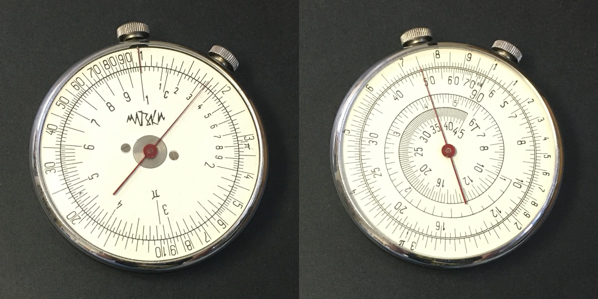

* Purchased October 7, 2020
    * Ebay
    * $42.68 Shipped
    * Shipping from Uzbekistan (yes, really!)
    * Arrived October 15, 2020
    * Came with a post card from Moscow
* Scales
    * Front: A, D
    * Back: DI, S, T
    * Perhaps more like BI, CI | D, S, T ?
* Pink Plastic "Pillbox" Case
* Manual
    * Worn
    * April 22, 1965 stamped on face of sheet
    * [English Instructions on ISRM](https://www.sliderulemuseum.com/Manuals/KL-1_RussianCircularSlideRule.pdf)
* Two Screws on Face, rather than three.
* Excellent condition
    * Clean; Smooth operation
* Translations:
    * Logarithmic Scale: логарифмическая шкала
    * Circular: круговой
    * Calculator: калькулятор
    * Engineer: инженер
    * Circular Logarithmic Ruler KL-1: круговая логарифмическая линейка КЛ-1

[Return to Top](#top)

---

## Frederick Post 1457 Mannheim Trig
### [Frederick Post Page on ISRM](https://www.sliderulemuseum.com/Post.htm)

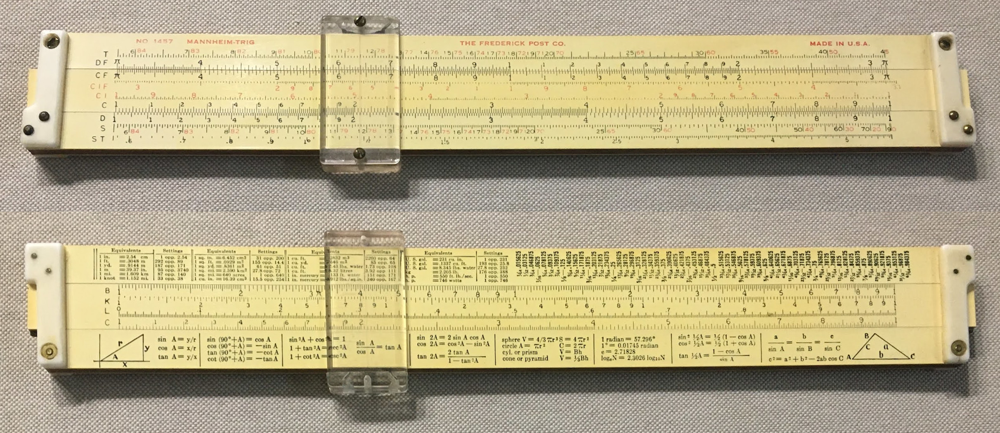

* Purchased October 15, 2020
    * Ebay
    * $20.07 Shipped
    * Arrived October 15, 2020
* Same as Roos SR-109
* Manufactured 1941 - 1945
    * Material: Wood stock with plastic laminate, plastic end pieces
    * Made by The Roos Company prior to Charvoz-Roos merger (1946)
    * According to ISRM, 1457s made in 1956 had metal end pieces
* Scales:
    * Front Scale: T, DF [ CF, CIF, CI, C ] D, S, ST
    * Back Scale: Conversions [ B, K, L, C ] Trig Identities
* Good condition.
    * Slide NOT delaminating
    * Cursor loose, slides too easily. Is spring faulty, or installed incorrectly? Perhaps I can fix it.
    * Top stator rail not aligned with bottom rail
* Includes "Alligator Skin" Leather Case
    * Written inside flap:
        * "A. C. Hagen A/C"
* Compare to [Roos SR-109](#roos109) above.

[Return to Top](#top)

---

## Sun Hemmi No. 130 System Darmstadt
### [Sun Hemmi Page on ISRM](https://www.sliderulemuseum.com/Hemmi.htm)

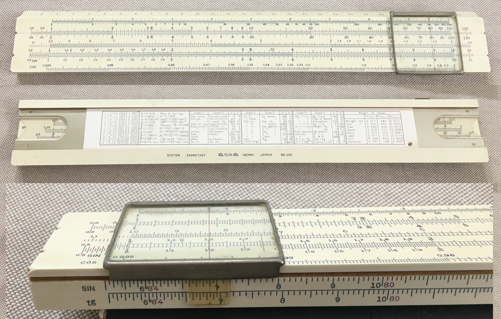

* Purchased November 19, 2020
    * Ebay
    * $47.82 Shipped
    * Shipping from Haifa, Israel
    * Shipped November 22, 2020
    * Shipped via Israel Post
    * Arrived December 3, 2020
* Scales:
    * Front: 27cm || L, K, A [B, CI, C] D, P || S, T
        * Scales not labeled except for D (SIN) and P (COS)
        * S and T on front edge as SIN / COS and tg / Ctg
        * Reverse scales (CI, COS, Ctg, but not P) in Red
    * Rear: [L, LL1, LL2, LL3]
        * [lg x, e^0.01x, e^0.1x, e^x]
    * Back: Conversions
* Date Code "OC"
    * Manufactured March 1964
* Includes cardboard box/case
    * "SUN HEMMI Bamboo Slide Rule"
    * Box does not have ends
    * Stars drawn on box

[Return to Top](#top)

---

## Pickett Model 200
### [Pickett Page on ISRM](https://www.sliderulemuseum.com/Pickett.htm)
### [Pickett Reference Image on ISRM](https://www.sliderulemuseum.com/Manuals/Pickett_Chronology.jpg)

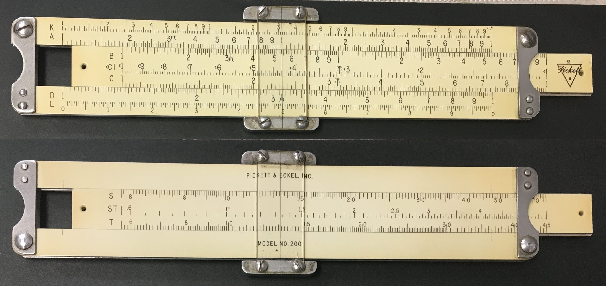

* Purchased January 11, 2021
    * Ebay
    * $17.83 Shipped
    * Seller accidentally shipped me the wrong slide rule, so he is shipping this one the next day and letting me keep [the extra rule](#ke4058)!
    * Arrived January 18, 2021
* [Pickett Metal Slide Rules Chronology](https://osgalleries.org/journal/displayarticle.cgi?match=1.1/V1.1P5.pdf)
* [Pickett Metal Slide Rules - A Brief Update](https://osgalleries.org/journal/displayarticle.cgi?match=3.2/V3.2P47a.pdf)
* Manufactured Early 1953-1955?
    * Aluminum
        * Shiny edges, not corroded or dark
    * Logo Style 3
        * "38" Above Logo
    * Stamped Aluminum Posts
        * "Smooth Stamped Posts Contoured to Finger Tip"
    * Plain Flat Lens
    * Machined Metal Cursor Bars
    * Grooved Rails
    * Male Slide
    * No Slide Tension Springs
* Scales:
    * Front: K, A [ B, CI, C ] D, L
    * Back: Blank [ S, ST, T ] Blank
* Includes leather case with pocket clip
    * Initials “J.C.P.” written below clip
* Good condition
    * Smooth operation
    * One small crack in each cursor lens

[Return to Top](#top)

---

## K&E N4058W Beginner’s Slide Rule
### [K&E Page on ISRM](https://www.sliderulemuseum.com/KE_Standard.htm)
### [Clark McCoy's K&E N4058W Page](https://www.mccoys-kecatalogs.com/KEModels/ke4058family.htm)
### [K&E N4058W on Smithsonian Museum web page](https://americanhistory.si.edu/collections/search/object/nmah_1214624)

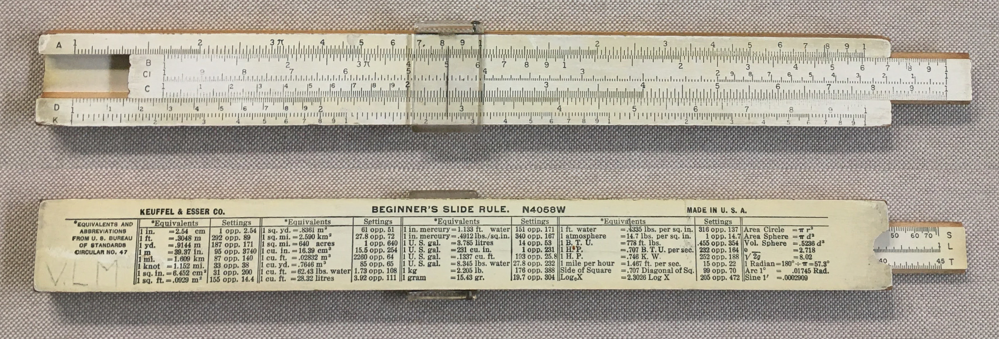

* [Clark McCoy's K&E N4058W Scans Page](https://www.mccoys-kecatalogs.com/KECollection/4058/keN4058W_2_1.htm)
* Sent to me accidentally when I ordered the [Pickett Model 200](#pickett200), so the seller let me keep it!
    * Arrived January 18, 2021
* [Manual](https://www.mccoys-kecatalogs.com/KEManuals/4058-1944/4058manual.pdf)
* Includes leather case
* Manufactured 1954-1960
    * One-piece clear plastic cursor
* Scales:
    * Front: A [ B, CI, C ] D, K
    * Back: Equivalents [ S, L, T ]
* Fair condition
    * Printing at right end of scales is worn
    * Smooth operation
    * "V.L.M" written on back
* Unusual?
    * Does not have the "window" on the back of the rule to read the S, L, and T scales.
    * There is a rounded finger cutout at the right end of the back of the rule, but no window.
    * Rounded cutout seems irregular. Added by an owner?
    * Clearly labeled "N4058W" on back. The model without the window that is closest is labeled "4058D"
    * Emailed Clark McCoy
    * Same as [K&E N4058W on Smithsonian Museum web page](https://americanhistory.si.edu/collections/search/object/nmah_1214624)

[Return to Top](#top)

---

## Pickett Model N14 ES Military Ranging
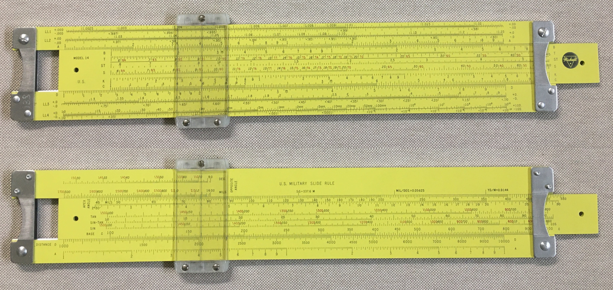

* Birthday present from Lys
    * She got it from Ebay
    * She gave it to me March 20, 2021
* Includes
    * Cardboard box
        * "138" written on one side and one end of box
    * Leather case with slot for instruction slip
        * "US" embossed in gold on front, partly worn off
        * "138" writtin inside flap
    * Plastic instruction slip
    * Belt loop
    * Slide Rule Guarantee Registration Card
        * Serial Number 863398
    * Rule in original plastic bag
    * Receipt from "Northeast Technical Institute"
        * $10.00
        * October 15, 1975
        * Pam Betteys
        * For "Slide Rule #138"
* Scales
    * Front Scale: LL1+/-, LL2+/-, A [ B, T Cot, ST, S Cos, K,  C ] D, LL3+/-, LL4+/-
    * Back Scale: Opposite angle Deg, Deg,  Mils, Mils [ Apex angle, Tan CoTan, Sin-Tan, Sin CoSin, Base C ], Distance D, A
* Manufactured 1958 -1962
    * Aluminum
    * Logo style 4
    * Stamped Aluminum Posts
        * "Grooved Stamped Posts Contoured to Finger Tip"
        * "138" engraved on front left post
    * Grooved Convex Lens
    * Extended Nylon Cursor Bars
    * No Grooves in Rails for Cursor
    * Grooved Slide
    * Slide Tension Springs
* Like-New condition
    * Clean and Shiny
    * Complete
    * Operates smoothly

[Return to Top](#top)

---

## Pickett Model 500 Ortho Phase Log Log
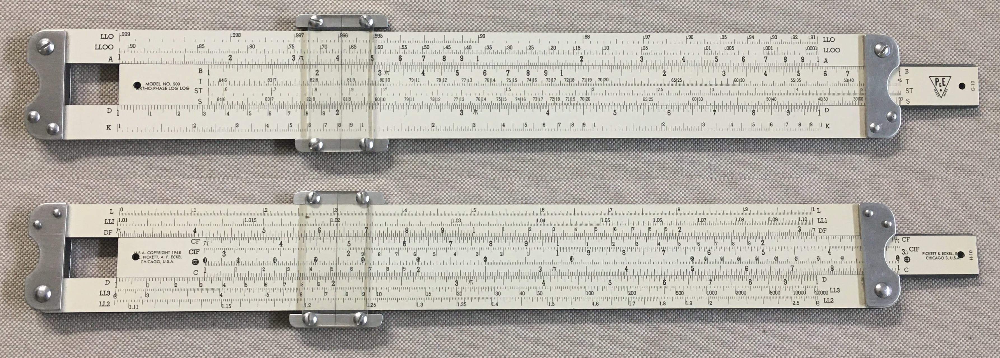

* Purchased May 18, 2021
    * Ebay
    * $21.34
    * Shipped via USPS
    * Arrived May 21, 2021
* Scales
    * Front Scale (artwork: G-10): LL0, LL00, A [ B, T, ST, S ] D, K
    * Back Scale (artwork: H-10): L, LL1, DF [ CF, CIF, CI, C ] D, LL3, LL2
* Manufactured 1948-1950
    * "Period 1"
    * Magnesium
        * Edges corroded and dark
        * Slide and Cursor slide easily and smoothly
    * Logo Style 1 "P&E"
        * This logo used 1945-1950
    * "U.S.A. COPYRIGHT 1948" on back of slide, left end.
        * So, Manufactured 1948-1950 ?
    * Grooved Rails
    * Male Slide
    * Stamped Stainless Steel Posts
        * "Smooth Stamped Posts Contoured to Finger Tip"
    * Plain Flat Lens
    * Machined Metal Cursor Bars
        * Stainless Steel?
        * Shiny!
        * Serial Number stamped on top bar: B060316
    * No Slide Tension Springs
    * An early version:
        * Artwork marks G-10 and H-10 (ISRM also shows one with no artwork marks. Is that earlier?)
        * Heavier serif scale labels
        * Black dot values on CI scale
        * No dot, circle, or arrow to indicate descending values on trig scales
* Felt slip cover

[Return to Top](#top)

---

## Pickett Model N200-T Trig

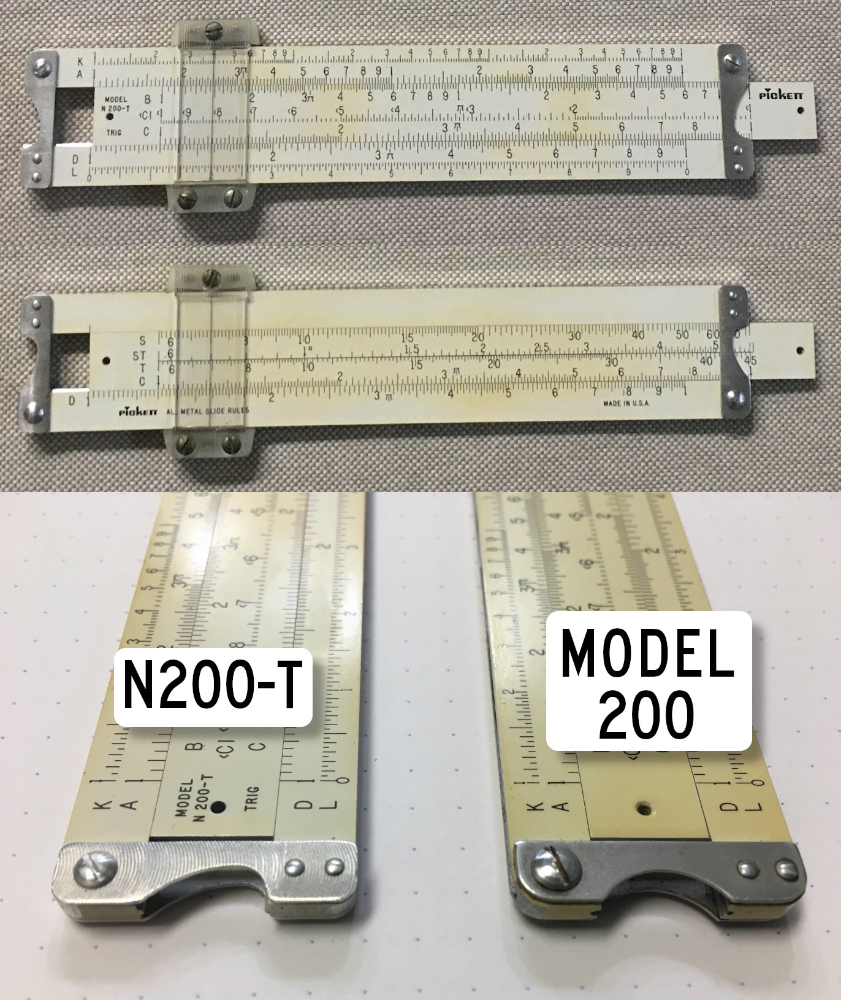

* Purchased June 18, 2021
    * Ebay
    * $26.69 Shipped
    * Shipped via USPS
    * Arrived June 24, 2021
* Manufactured 1964-1975
    * Logo Style 6
        * No Artwork Mark
    * Aluminum
        * Shiny edges, not corroded or dark
    * Stamped Aluminum Posts
        * Posts with "Hooked" finger contour
        * Circular machine marks on posts
        * Mike Konshak at ISRM told me he thinks the “hooked” posts were an experiment between the square posts and later curved posts.
        That would mean this rule was manufactured in the middle 1960’s.
    * Grooved Convex Lens
    * Nylon Cursor Bars
    * No Grooves in Rails for Cursor
    * Grooved Slide
    * No Slide Tension Springs
* Scales:
    * Front: K, A [ B, CI, C ] D, L
    * Back: Blank [ S, ST, T, C ] D
* Includes leather case with top flap
    * Pull flap to pull rule out of case
* Good condition
    * Smooth operation

[Return to Top](#top)

---

## Pickett Model 300
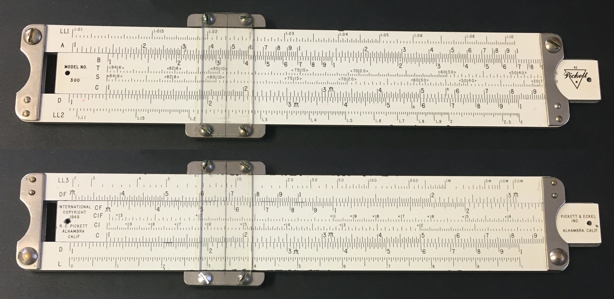

* Purchased August 4, 2021
    * CT Auctions; "Caring Transitions" Estate Sale
    * $100 Shipped, with Pickett Model 300, 600, 1000
    * Shipped via USPS
    * Arrived August 17, 2021
* Scales
    * Front Scale(Artwork 42): LL1, A [ B, T cot, S Cos, C ] D, LL2
        * Trig scales marked with < and >
    * Back Scale: LL3, DF [ CF, CIF, CI, C ] D, L
        * Inverse scales marked with <
* Manufactured 1950-1953?
    * Magnesium
        * Feels lighter than the Model 200 and 700
        * Edges corroded and dark
        * Slide and Cursor slide unevenly
    * "Period 2"
    * Logo Style 3
    * Grooved Rails
    * Male Slide
    * Stamped Stainless Steel Posts
        * "Smooth Stamped Posts Contoured to Finger Tip"
    * Plain Flat Lens
    * Machined Metal Cursor Bars
        * Stainless Steel
* Includes leather case without pocket clip
    * “JIMERSON” stamped on case
    * Triangle Pickett logo on both sides of case

[Return to Top](#top)

---

## Pickett Model 600
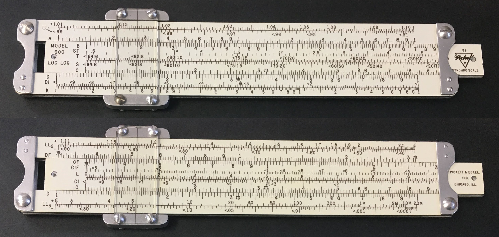

* Purchased August 4, 2021
    * CT Auctions; "Caring Transitions" Estate Sale
    * $100 Shipped, with Pickett Model 300, 600, 1000
    * Shipped via USPS
    * Arrived August 17, 2021
* Scales
    * Front Scale(Artwork 81): LL1+, LL1-, A [ B, T, ST, S, T, C ] D, DI, K
        * "SYNCHRO SCALE"
    * Back Scale: LL2+, LL2-, DF [ CF, CIF, CI, L, C ] D, LL3+, LL3-
    * Descending values on CI, CIF, and trig scales marked with left-pointing arrows
* Manufactured 1950-1953?
    * Magnesium
        * Feels lighter than the Model 200 and 700
        * Edges corroded and dark
        * Slide and Cursor slide unevenly
    * "Period 2"
    * Logo Style 3
    * Grooved Rails
    * Male Slide
    * Stamped Aluminum Posts
        * "Smooth Stamped Posts Contoured to Finger Tip"
    * Plain Flat Lens
        * Missing two screws
    * Machined Metal Cursor Bars
* Includes leather case with pocket clip

[Return to Top](#top)

---

## Pickett Model 1000 Ortho-Phase Duplex
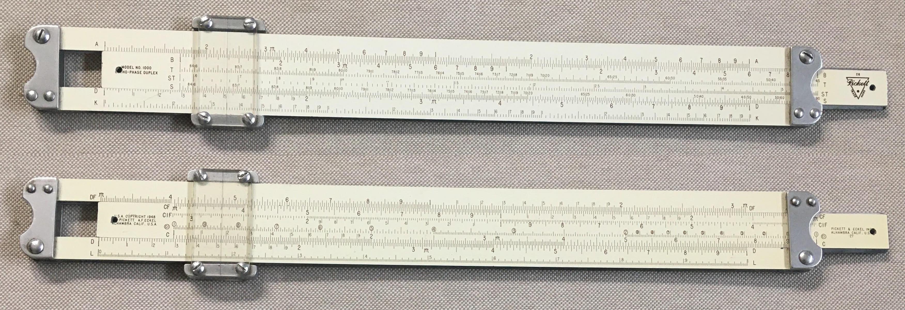

* Purchased August 4, 2021
    * CT Auctions; "Caring Transitions" Estate Sale
    * $100 Shipped, with Pickett Model 300, 600, 1000
    * Shipped via USPS
    * Arrived August 17, 2021
* Scales
    * Front Scale(Artwork 26): A [ B, T Cot , ST, S Cos] D, K
    * Back Scale(Artwork 27): DF [ CF, CIF, CI, C ] D, L
        * Note the CI and CIF scales with the numbers circled
* Manufactured 1948-1950
    * "Period 1"
    * Magnesium
        * Edges corroded and dark
        * Slide and Cursor slide easily and smoothly
    * "U.S.A. COPYRIGHT 1948" on back of slide, left end.
    * Logo Style 2
        * This logo used 1949-1950
        * So, Manufactured 1949-1950 ?
    * Grooved Rails
    * Male Slide
    * Stamped Stainless Steel Posts
        * "Smooth Stamped Posts Contoured to Finger Tip"
    * Plain Flat Lens
    * Machined Metal Cursor Bars
        * Stainless Steel?
        * Shiny!
        * Serial Number stamped on top bar: A117221
    * No Slide Tension Springs
    * This would be the second version:
        * Artwork marks 26 and 27
        * Lighter, condensed sans serif scale labels
        * Circled values on CI scale
        * No circles or arrows to indicate descending values on trig scales
        * The first version had Artwork marks J-10 and K-10, heavier serif scale labels, black dot values on CI scale; compare to my [Model 500](#pickett500)
* Felt slip cover
    * Dirty with ink marks
* [Includes Manual](https://www.sliderulemuseum.com/Manuals/ISRM_M277_Pickett_1000_Orthophase_Instructions_DonatedByDanSwerdlow.pdf)
    * “How To Use The Pickett 1000 Ortho-Phase Duplex Slide Rule”
    * Copyright 1948 Pickett & Eckel, Inc.
    * Written on cover in pencil:
    > William H. McLean, Jr. U.S.M.C. U.S. Naval Academy Prep School  
    > U.S. Naval Base Newport R.I.

[Return to Top](#top)

---

## Pickett Model 1006 Duplex Trig

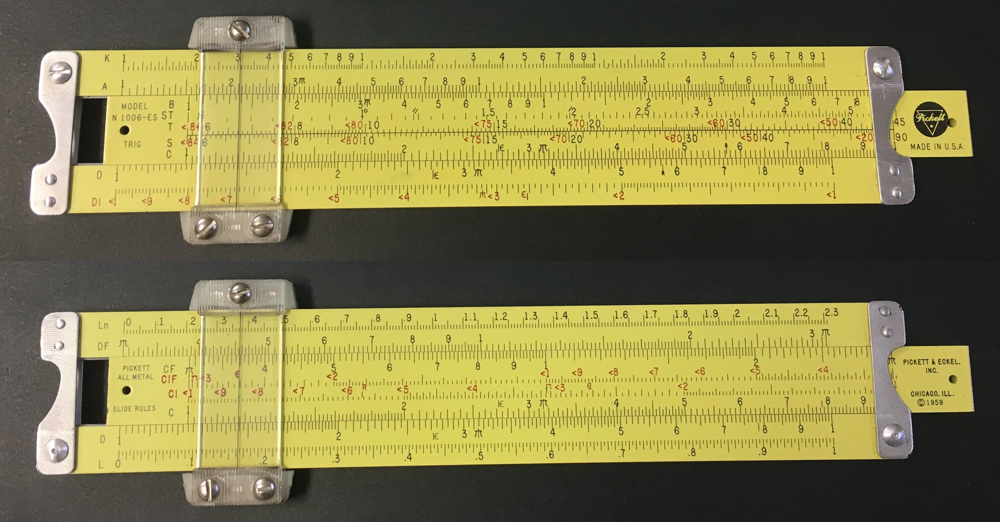

* Purchased February 13, 2022
    * Ebay
    * $42.70 Shipped
    * Arrived February 22, 2022
* Manufactured Mid 1960s
    * Aluminum
    * Front of Slide:
        * Logo Style 4
        * “MODEL N 1006-ES TRIG”
        * “MADE IN U.S.A.”
        * No Artwork Mark
    * Back of Slide:
        * “PICKETT ALL-METAL SLIDE RULES”
        * “PICKETT & ECKEL, INC. CHICAGO, ILL. ©1959”
        * No Artwork Mark
    * Stamped Aluminum Posts
        * Posts with “Hooked” finger contour
    * Grooved Convex Lens
    * Nylon Cursor Bars
    * No Grooves in Rails for Cursor
    * Grooved Slide
    * No Slide Tension Springs
* Scales:
    * Front Scale K, A [ B, ST, T, S, C ] D, DI
    * Back Scale Ln, DF [ CF, CIF, CI, C ] D, L
    * Descending values on CI, CIF, and trig scales in red with left-pointing arrows
* Good condition
    * Cleaned cursor and sliding surfaces
    * Aligned top rail to bottom rail
* Includes Leather Case with Pocket Clip
    * Pull Tab to remove rule from case
    * Pull Tab has Style 6 Logo

[Return to Top](#top)

---

# Wish List

---

## Pickett Model 100 “Douglas Sky Rule”

    Douglas Sky Rule on International Slide Rule Museum

* Scales:
    * Front Scale (A side)(Artwork #56): Dynamic Pres., Temp Rise [ Static Pres., Pres. Alt, Density Alt., C ] D, True Mach. TAIS
    * Back Scale (B side): Impact Pres., Std. Temp., Pres. Alt. [ Temp. Venier, Pres. Alt. ] True Mach No., Dial Airspeed. ] Blank

[Return to Top](#top)

---

## Pickett Model 400 Business Rule

    Pickett Model 400 on International Slide Rule Museum

* Scales:
    * Note: Special C% and R% scales for Cost and Retail mark up. DF & D scale labeled as RF & R.
    * Front Scale (artwork: 43): K, A [ B, CI, C ] D, L
    * Back Scale: R%, RF [ CF, Unit, Doz(C%), Gross, C ] R, C%, Gross, Doz(R%), Unit

[Return to Top](#top)

---

## Concise Model 270

    Concise 270 on International Slide Rule Museum

* Scales:
    * Front Scale: L, D ( C, CI, A, K )
    * Back Scale: DI, D ( S, T1, T2, ST )

### Concise Model 271

    Concise 271 on International Slide Rule Museum

* Scales
    * Front Scale: L, D ( C, CI, A, K )
    * Back Scale: DI, D ( S Cos, T1 Cot1, T2 Cot2, ST )

[Return to Top](#top)

---

## Concise Model 300

    Concise 300 on International Slide Rule Museum

* Scales
    * Front Scale: K, A, D ( C, CI, B, L )
    * Back Scale: LL3, LL2, D ( C, S Cos, T1 Cot1, T2 Cot2, ST )

[Return to Top](#top)
