# Slide Rules

## Journal of the Oughtred Society

I wrote an article for the [JOS](https://www.oughtred.org/journal.shtml) about the first Slide Rule I bought myself, the Pickett Model 700 USAF Aerial Photography Slide Rule:
[Pickett USAF Aerial Photography Slide Rules](./USAF-Aerial-Photo-Rule.html)
It was published in [JOS Volume 32, No. 1, 2023](http://osgalleries.org/journal/displayarticle.cgi?match=32.1/V32.1P55.pdf).

## My Slide Rule Collection

In Order of Acquisition

* [Concise Model CTCS-552](#concise552)
* [Pickett 902-T Simplex Trig](#pickett902)
* [Roos Company No. SR-109](#roos109)
* [Pickett Model 700 A-2](#pickett700)
* [Pickett Model 520 A-1](#pickett520)
* [Aristo 0903LL Scholar](#aristo0903ll)
* [Aristo 867U Darmstadt](#aristo867u)
* [Pickett N4-ES](#pickettn4)
* [KL-1 Circular Slide Rule](#kl1)
* [Frederick Post 1457 Mannheim Trig](#post1457)
* [Sun Hemmi No. 130 System Darmstadt](#hemmi130)
* [Pickett Model 200](#pickett200)
* [K&E N4058W Beginner’s Slide Rule](#ke4058)
* [Pickett Model N14 ES Military Ranging](#pickett14)
* [Pickett Model 500 Ortho Phase Log Log](#pickett500)
* [Pickett Model N200-T Trig](#pickettN200T)
* [Pickett Model 300](#pickett300)
* [Pickett Model 600](#pickett600)
* [Pickett Model 1000 Ortho-Phase Duplex](#pickett1000)
* [Pickett Model 1006 Duplex Trig](#pickett1006)
* [Radiac Calculator No. 1](#radiac1)
* [Pickett Model 400 Business Rule](#pickett400)
* [Pickett Model 100 “Douglas Sky Rule”](#pickett100)
* [Aristo 868 Studio](#aristo868)
* [Pickett Model N700 A-2](#pickettN700T)
* [Post 1447](#post1447)
* [Halden Calculex](#haldenCalculex)
* [Pickett Model 800-T](#pickett800T)
* [Dietzgen Redirule 1776](#dietzgen1776)
* [UTO No. 601](#uto601)
* [Picket Model 903](#pickett903)
* [Aristo 0968 Studio](#aristo0968)
* [Aristo 0903 Scholar](#aristo0903)
* [Sterling Pocket Metric Converter](#sterlingmetric)
* [Ole Jorgensen Slide Rule Pencil Cup](#sliderulepencilcup)
* [Kitchen Slide Rule](#kitchensliderule)
* [Post Versalog](#postversalog)
* [K & E 4092-3](#ke4092)
* [Dietzgen Redirule 1771](#dietzgen1771)
* [Vernon Sterling Slide Rule Tie Bar](#vernontiebar)
* [Picket Model N803-T](#pickettn803t)

## Wish List

* [Log-Log Rules](#loglogrules)
* [Misc Rules](#misc)
* [Concise Model 270](#concise270)
* [Concise Model 300](#concise300)

All photos ©2025 A. E. Rinehart unless otherwise noted.

-----

## Concise Model CTCS-552
[Concise Page on ISRM](https://www.sliderulemuseum.com/Concise.htm)

This was in a box of stuff Dad said I could have if I was interested when I was a kid.
There were also some James Bond novels and a little pocket tool set.

I thought the design of the scales was interesting, with the neat numbers and ticks, and the index indicators on C and D.
It seemed clean and purposeful.

The reference card with all of its conversion factors and tables, the table of elements, and rulers were powerful tools to my little _Star Trek_ addled mind.

I played with it like a toy and left it exposed to sunlight in a window sill. If I remember correctly, the sunlight is what hurt it worst.

When Dad visited in December 2021, I showed him my collection and told him I got this Concise from him.
He said he didn't remember it.
In fact, he said the slide rule he used was a yellow pocket-size Pickett!
He said he liked Picketts because they were “built like tanks” and did anyone else even make slide rules?
He forgot which model he had, though.

* From Dad, 1976?
* Scales: 4in || D ( C, CI, L, A, K) || 10cm
* Table of the Elements and Temperature Conversion Chart on back
* Insert ©1966
    * Length, Area, Weight, Volume, Decimal Equivalents, Velocity, Gas Constants, Flow Rate, Energy, Pressure, Useful Constants
* Includes manual
    * Manual © 1967
* Includes red vinyl case
* Imprinted "Sturgis Equipment Company"
* Poor condition, but complete and functional. Taped together.
    * I played with it like a toy and left it exposed to sunlight in a window sill. If I remember correctly, the sunlight is what hurt it worst.

[Return to Top](#top)

-----

## Pickett 902 Simplex Trig
### [Pickett Page on ISRM](https://www.sliderulemuseum.com/Pickett.htm)
### [Pickett Reference Image on ISRM](https://www.sliderulemuseum.com/Manuals/Pickett_Chronology.jpg)
### [Just like this one on Greg's Slide Rules](http://sliderule.ozmanor.com/rules/sr-0128-pick902t-01.html)

My Concise 552 made me curious about slide rules, so I searched for more information about them.
I found ISRM and some other info about slide rules.
I mentioned all of this to Lys, and she looked on Ebay and found a lot of two slide rules for $20: this Pickett 902, and the [Roos SR-109](#roos109) below.

* Lys got me this!
    * Lot of two (with Roos SR-109 below) for ~$20
    * ~2010?
* [Pickett Metal Slide Rules Chronology](https://osgalleries.org/journal/displayarticle.cgi?match=1.1/V1.1P5.pdf)
* [Pickett Metal Slide Rules - A Brief Update](https://osgalleries.org/journal/displayarticle.cgi?match=3.2/V3.2P47a.pdf)
* Manufactured 1955 - 1957
    * Aluminum
        * Shiny edges, not corroded or dark
        * 1953 or Later: Transition from Magnesium to Aluminum occurred in 1953 (?)
    * “Period 3”
    * Logo Style 3
        * “39” Above Logo
    * Stamped Aluminum Posts
        * “Smooth Stamped Posts Contoured to Finger Tip”
    * Plain Flat Lens
    * Machined Metal Cursor Bars
    * Grooved Rails
    * Grooved Slide
    * Slide Tension Springs
    * Slide Reverse has “41” artwork mark, no copyright mark.
    * Scales
        * Front: K, A [B, T, S, C] D, L
        * Rear: Instructions
* Good condition

[Return to Top](#top)

-----

## Roos Company No. SR-109
### [Charvoz-Roos Page on ISRM](https://www.sliderulemuseum.com/CharvozRoos.htm)

* Lys got me this!
    * Lot of two (with Pickett 902-T above) for ~$20
    * ~2010?

* Manufactured 1941 - 1946, probably 1945
    * Made by The Roos Company prior to Charvoz-Roos merger (1946)
    * Material: Wood stock with plastic laminate, plastic end pieces
* Scales:
    * Front Scale: T, DF [ CF, CIF, CI, C ] D, S, ST
    * Back Scale: Conversions [ B, K, L, C ] Trig Identities
* Includes "MANNHEIM-TRIG" manual
    * Manual © 1945
    * Manual is from Acu-Rule
* Fair condition. Plastic on slide delaminating from wood slightly at ends.
* Includes leatherette case
    * No markings on case
        * This seems to be the same size and design as the case that came with the [Post 1457](#post1457), except with smooth leather
    * Flap torn off
        * When I got it, the flap wasn't torn off yet, but it was close
    * Written inside flap:
        * "Mrs. J. S. Payte 322 Dennis St. Nacodoches Texas"
* Compare to [Frederick Post 1457 Mannheim Trig](https://www.sliderulemuseum.com/Post/S076_Post_1457.jpg) ISRM S076
* Also compare to [Frederick Post 1457](#post1457) below.

[Return to Top](#top)

-----

## Pickett Model 700 A-2
### "U. S. AIR FORCE AERIAL PHOTO SLIDE RULE TYPE A-2"
### [Pickett Page on ISRM](https://www.sliderulemuseum.com/Pickett.htm)

* Purchased June 12, 2020
    * Ebay
    * $32 Shipped
* [Manual on ISRM](https://www.sliderulemuseum.com/Manuals/M184_P232_Pickett_USAF_AerialPhoto_M520-700.pdf)
    * Working on a better copy: I am performing OCR and Proofreading on [this older version of the manual found on this page](http://sliderule.ozmanor.com/man/man-download.html)
* [Pickett Metal Slide Rules Chronology](https://osgalleries.org/journal/displayarticle.cgi?match=1.1/V1.1P5.pdf)
* [Pickett Metal Slide Rules - A Brief Update](https://osgalleries.org/journal/displayarticle.cgi?match=3.2/V3.2P47a.pdf)
* Manufactured Early 1950s
    * Aluminum
        * Shiny edges, not corroded or dark
        * 1953 or Later: Transition from Magnesium to Aluminum occurred in 1953 (?)
    * Documentation states that Aerial Photo Slide Rule is "Front" and Slide Rule Scales are "Reverse"
    * Scales:
        * Front: Ground Size (Feet), Image Size (CM, FT), Focal Length (Inches), Altitude (Feet)
        * Rear: L, A DF [ CF, CIF, T, S, C ] D, DI, K
    * Logo Style 3
        * "59" Above Logo
    * Stamped Aluminum Posts
        * "Smooth Stamped Posts Contoured to Finger Tip"
    * Plain Flat Lens
    * Machined Metal Cursor Bars
    * Grooved Rails
    * Male Slide
    * No Slide Tension Springs
* Includes Case with Conversions and Formulas and pocket clip
* Good condition.

[Return to Top](#top)

-----

## Pickett Model 520 A-1
### "U. S. AIR FORCE AERIAL PHOTO SLIDE RULE TYPE A-1"
### [Pickett Page on ISRM](https://www.sliderulemuseum.com/Pickett.htm)
### 

* Purchased June 25, 2020
    * Ebay
    * $48 Shipped
* [Manual on ISRM](https://www.sliderulemuseum.com/Manuals/M184_P232_Pickett_USAF_AerialPhoto_M520-700.pdf)
* [Pickett Metal Slide Rules Chronology](https://osgalleries.org/journal/displayarticle.cgi?match=1.1/V1.1P5.pdf)
* [Pickett Metal Slide Rules - A Brief Update](https://osgalleries.org/journal/displayarticle.cgi?match=3.2/V3.2P47a.pdf)
* Manufactured 1962 - 1966
    * Aluminum
        * Shiny edges, not corroded or dark
    * Documentation states that Aerial Photo Slide Rule is "Front" and Slide Rule Scales are "Reverse"
    * Scales:
        * Front: Ground Size (Feet), Image Size (CM, FT), Focal Length (Inches), Altitude (Feet)
        * Rear: L, A DF [ CF, CIF, T, S, C ] D, DI, K
    * Logo Style 4
        * No Artwork Mark
        * No Copyright Mark
    * Stamped Aluminum Posts
        * "Grooved Stamped Posts Contoured to Finger Tip"
    * Grooved Convex Lens
    * Nylon Cursor Bars
    * No Grooves in Rails for Cursor
    * Grooved Slide
    * Slide Tension Springs
    * Slide Aerial Photo side has "57" artwork mark, no copyright mark.
* Includes Original Box
* Includes Case with Conversions and Formulas
    * Leather case with plastic insert.
    * Appears that the case used to have a "DYMO Embosser" label applied. Cannot read what it said.
* Includes Instruction Manual
* Includes "Slide Rule Guarantee Registration Card"
    * Serial Number 209763
* Excellent Condition

[Return to Top](#top)

---

## Aristo 0903LL Scholar
### [Aristo Page on ISRM](https://www.sliderulemuseum.com/Aristo.htm)

* Purchased July 8, 2020
    * Ebay
    * $19.25 Shipped
    * Arrived July 12, 2020
* [Manual on ISRM](https://www.sliderulemuseum.com/Manuals/ISRM_M316_Aristo_Scholar_0903LL_VS-2_GiftOfEdwardWright.pdf)
* Scales:
    * Front: L, K, A [ B, CI, C ] D, S, ST, T
    * Rear: 25cm [ S, LL2, LL3] 8 inch(bi-directional)
        * The inch ruler includes one inch past the zero in each direction, one graduated in 1/32", the other in 1/20".
* Convex Plastic Cursor
* “ARISTO” logotype molded in braces
* Manufacturing Code "3LR28"
    * 1971
    * Geretsried
    * Lot 28
* Includes Plastic Box
    * “Dieter Engel…” written in pencil
* Excellent Condition

[Return to Top](#top)

---

## Aristo 867U Darmstadt
### [Aristo Page on ISRM](https://www.sliderulemuseum.com/Aristo.htm)

* Purchased July 19, 2020
    * Ebay
    * $17.12 Shipped
    * Arrived July 24, 2020
* Scales:
    * Front: K, A [B, BI, CI, C] D, P, S, T
        * x³, x² [ x², 1/x², 1/x, x ] x, √(1-x²), sin, tg
        * Top: Transparent Centimeter Scale
        * Bottom: Transparent Inch Scale
    * Rear: [L, LL1, LL2, LL3]
        * [lg x, e^0.01x, e^0.1x, e^x]
        * Aristo-Darmstadt
        * Dennert & Pape Hamburg
        * "5328" Date Code Stamp
        * Clear back over slide with hairlines at indexes
* Plastic Cursor
    * W & HP hairlines
* Includes Leather Case
    * Worn but functional
    * Stamped "ARISTO MADE IN GERMANY"
* Manufacturing Code Stamp "5328"
    * Not the later alphanumeric Aristo date code
    * Oughtred Society Journal Article: [DENNERT & PAPE and ARISTO Slide Rules 1872 - 1978](https://osgalleries.org/journal/displayarticle.cgi?match=6.1/V6.1P4.pdf)
    * Old enough to have the "circle and angle" symbol at the right end of the scale, Figure 16 in the above article, which supposedly ended in 1952, with "Nr. 867U" catalog number.
    * 1953, Lot 28
* Good Condition
    * Crack in body at left end of K scale
    * Broken plastic on back

[Return to Top](#top)

---

## Pickett N4-ES
### [Pickett Page on ISRM](https://www.sliderulemuseum.com/Pickett.htm)
### [Pickett Reference Image on ISRM](https://www.sliderulemuseum.com/Manuals/Pickett_Chronology.jpg)

* [Manual on ISRM Site](https://www.sliderulemuseum.com/Manuals/M76_Pickett_HowToUseLogLogSR_1953.pdf)
…or at least the only one I could find that discusses the TWO Tangent scales
* Purchased September 24, 2020
    * Ebay
    * $42.70 Shipped
    * Arrived October 1, 2020
* Scales
    * Front: LL1+.00D/-.00D, LL2+.0D/-.0D, DF/m [ CF/m, TH, SH, Ln, L, CI, C ] D, LL3+.D/-.D, LL4+D./-D.
    * Rear: ∛ #1, ∛ #2, ∛ #3, DF [ CF, CIF, T1, T2, ST, S Cos,  CI, C ] D, DI, √ #1, √  #2
* Manufactured 1962 - 1964
    * Aluminum
    * Logo Style 4
        * No Artwork Mark
        * “MADE IN U.S.A.” under logo like Style 5
    * Stamped Aluminum Posts
        * “Grooved Stamped Posts Contoured to Finger Tip”
        * Dull, not shiny
    * Grooved Convex Lens
    * Nylon Cursor Bars
    * No Grooves in Rails for Cursor
    * Grooved Slide
    * Slide Tension Springs
    * Slide has “PICKETT & ECKEL INC. CHICAGO ILL. U.S.A.”
        * Pickett moved to California in 1964
* Plastic Cursor
    * Dirty and cloudy. Cleaned up well.
    * Slightly Yellowed
* Includes Leather Case
    * “FRANK BUSH” stamped inside case flap
    * There has been a sticker on the front and back of the case, like price tags?
    * There is still some adhesive remaining from each sticker. Still sticky, so probably recent.
    * There are scratches on the case where someone removed the stickers. They are not deep scratches.
* Good Condition
    * Dirty, Cleaned up well.
    * Complete
    * Operates smoothly

[Return to Top](#top)

---

## KL-1 Circular Slide Rule

* Purchased October 7, 2020
    * Ebay
    * $42.68 Shipped
    * Shipping from Uzbekistan (yes, really!)
    * Arrived October 15, 2020
    * Came with a post card from Moscow
* Scales
    * Front: A, D
    * Back: DI, S, T
    * Perhaps more like BI, CI | D, S, T ?
* Pink Plastic "Pillbox" Case
* Manual
    * Worn
    * April 22, 1965 stamped on face of sheet
    * [English Instructions on ISRM](https://www.sliderulemuseum.com/Manuals/KL-1_RussianCircularSlideRule.pdf)
* Two Screws on Face, rather than three.
* Excellent condition
    * Clean; Smooth operation
* Translations:
    * Logarithmic Scale: логарифмическая шкала
    * Circular: круговой
    * Calculator: калькулятор
    * Engineer: инженер
    * Circular Logarithmic Ruler KL-1: круговая логарифмическая линейка КЛ-1

[Return to Top](#top)

---

## Frederick Post 1457 Mannheim Trig
### [Frederick Post Page on ISRM](https://www.sliderulemuseum.com/Post.htm)

* Purchased October 15, 2020
    * Ebay
    * $20.07 Shipped
    * Arrived October 15, 2020
* Same as Roos SR-109
* Manufactured 1941 - 1945
    * Material: Wood stock with plastic laminate, plastic end pieces
    * Made by The Roos Company prior to Charvoz-Roos merger (1946)
    * According to ISRM, 1457s made in 1956 had metal end pieces
* Scales:
    * Front Scale: T, DF [ CF, CIF, CI, C ] D, S, ST
    * Back Scale: Conversions [ B, K, L, C ] Trig Identities
* Good condition.
    * Slide NOT delaminating
    * Cursor loose, slides too easily. Is spring faulty, or installed incorrectly? Perhaps I can fix it.
    * Top stator rail not aligned with bottom rail
* Includes "Alligator Skin" Leather Case
    * Written inside flap:
        * "A. C. Hagen A/C"
* Compare to [Roos SR-109](#roos109) above.

[Return to Top](#top)

---

## Sun Hemmi No. 130 System Darmstadt
### [Sun Hemmi Page on ISRM](https://www.sliderulemuseum.com/Hemmi.htm)

* Purchased November 19, 2020
    * Ebay
    * $47.82 Shipped
    * Shipping from Haifa, Israel
    * Shipped November 22, 2020
    * Shipped via Israel Post
    * Arrived December 3, 2020
* Scales:
    * Front: 27cm || L, K, A [B, CI, C] D, P || S, T
        * Scales not labeled except for D (SIN) and P (COS)
        * S and T on front edge as SIN / COS and tg / Ctg
        * Reverse scales (CI, COS, Ctg, but not P) in Red
    * Rear: [L, LL1, LL2, LL3]
        * [lg x, e^0.01x, e^0.1x, e^x]
    * Back: Conversions
* Date Code "OC"
    * Manufactured March 1964
* Includes cardboard box/case
    * "SUN HEMMI Bamboo Slide Rule"
    * Box does not have ends
    * Stars drawn on box

[Return to Top](#top)

---

## Pickett Model 200
### [Pickett Page on ISRM](https://www.sliderulemuseum.com/Pickett.htm)
### [Pickett Reference Image on ISRM](https://www.sliderulemuseum.com/Manuals/Pickett_Chronology.jpg)

* Purchased January 11, 2021
    * Ebay
    * $17.83 Shipped
    * Seller accidentally shipped me the wrong slide rule, so he is shipping this one the next day and letting me keep [the extra rule](#ke4058)!
    * Arrived January 18, 2021
* [Pickett Metal Slide Rules Chronology](https://osgalleries.org/journal/displayarticle.cgi?match=1.1/V1.1P5.pdf)
* [Pickett Metal Slide Rules - A Brief Update](https://osgalleries.org/journal/displayarticle.cgi?match=3.2/V3.2P47a.pdf)
* Manufactured Early 1953-1955?
    * Aluminum
        * Shiny edges, not corroded or dark
    * Logo Style 3
        * "38" Above Logo
    * Stamped Aluminum Posts
        * "Smooth Stamped Posts Contoured to Finger Tip"
    * Plain Flat Lens
    * Machined Metal Cursor Bars
    * Grooved Rails
    * Male Slide
    * No Slide Tension Springs
* Scales:
    * Front: K, A [ B, CI, C ] D, L
    * Back: Blank [ S, ST, T ] Blank
* Includes leather case with pocket clip
    * Initials “J.C.P.” written below clip
* Good condition
    * Smooth operation
    * One small crack in each cursor lens

[Return to Top](#top)

---

## K&E N4058W Beginner’s Slide Rule
### [K&E Page on ISRM](https://www.sliderulemuseum.com/KE_Standard.htm)
### [Clark McCoy's K&E N4058W Page](https://www.mccoys-kecatalogs.com/KEModels/ke4058family.htm)
### [K&E N4058W on Smithsonian Museum web page](https://americanhistory.si.edu/collections/search/object/nmah_1214624)

* [Clark McCoy's K&E N4058W Scans Page](https://www.mccoys-kecatalogs.com/KECollection/4058/keN4058W_2_1.htm)
* Sent to me accidentally when I ordered the [Pickett Model 200](#pickett200), so the seller let me keep it!
    * Arrived January 18, 2021
* [Manual on Clark McCoy’s Site](https://www.mccoys-kecatalogs.com/KEManuals/4058-1944/4058manual.pdf)
* [_K&E's Beginner's Slide Rule Line_ on Following the Rules site](https://followingtherules.substack.com/p/k-and-es-beginners-slide-rule-line)
* Includes “leather” case
* Manufactured 1956-1958
    * One-piece clear plastic cursor
    * “Equivalents and Settings” table on back 1954-1958
    * Shallow thumb indentation rather than larger window on right end of the rear (See Tarantolo collection note below): 1956-1959
* Scales:
    * Front: A [ B, CI, C ] D, K
    * Back of Slide: [ S, L, T ]
    * Back of Rule: Equivalents and Settings table
* Fair condition
    * Printing at right end of scales is worn
    * Smooth operation
    * "V.L.M" written on back
* Unusual?
    * Does not have the deeper “window” cutout on the back of the rule to read the S, L, and T scales.
    * There is a shallow rounded finger cutout at the right end of the back of the rule, but no window.
    * Same as [K&E N4058W on Smithsonian Museum web page](https://americanhistory.si.edu/collections/search/object/nmah_1214624)
    * Same as [1956 N4058W in the Paul Tarantolo Collection on Oughtred Society site](https://osgalleries.org/collectors/tarantolo/kande4058_info_and_image.cgi?string=KEU378)

[Return to Top](#top)

---

## Pickett Model N14 ES Military Ranging

* Birthday present from Lys
    * She got it from Ebay
    * She gave it to me March 20, 2021
* Includes
    * Cardboard box
        * "138" written on one side and one end of box
    * Leather case with slot for instruction slip
        * "US" embossed in gold on front, partly worn off
        * "138" writtin inside flap
    * Plastic instruction slip
    * Belt loop
    * Slide Rule Guarantee Registration Card
        * Serial Number 863398
    * Rule in original plastic bag
    * Receipt from "Northeast Technical Institute"
        * $10.00
        * October 15, 1975
        * Pam Betteys
        * For "Slide Rule #138"
* Scales
    * Front Scale: LL1+/-, LL2+/-, A [ B, T Cot, ST, S Cos, K,  C ] D, LL3+/-, LL4+/-
    * Back Scale: Opposite angle Deg, Deg,  Mils, Mils [ Apex angle, Tan CoTan, Sin-Tan, Sin CoSin, Base C ], Distance D, A
* Manufactured 1958 -1962
    * Aluminum
    * Logo style 4
    * Stamped Aluminum Posts
        * "Grooved Stamped Posts Contoured to Finger Tip"
        * "138" engraved on front left post
    * Grooved Convex Lens
    * Extended Nylon Cursor Bars
    * No Grooves in Rails for Cursor
    * Grooved Slide
    * Slide Tension Springs
* Like-New condition
    * Clean and Shiny
    * Complete
    * Operates smoothly

[Return to Top](#top)

---

## Pickett Model 500 Ortho Phase Log Log

* Purchased May 18, 2021
    * Ebay
    * $21.34
    * Shipped via USPS
    * Arrived May 21, 2021
* Scales
    * Front Scale (artwork: G-10): LL0, LL00, A [ B, T, ST, S ] D, K
    * Back Scale (artwork: H-10): L, LL1, DF [ CF, CIF, CI, C ] D, LL3, LL2
* Manufactured 1948-1950
    * "Period 1"
    * Magnesium
        * Edges corroded and dark
        * Slide and Cursor slide easily and smoothly
    * Logo Style 1 "P&E"
        * This logo used 1945-1950
    * "U.S.A. COPYRIGHT 1948" on back of slide, left end.
        * So, Manufactured 1948-1950 ?
    * Grooved Rails
    * Male Slide
    * Stamped Stainless Steel Posts
        * "Smooth Stamped Posts Contoured to Finger Tip"
    * Plain Flat Lens
    * Machined Metal Cursor Bars
        * Stainless Steel?
        * Shiny!
        * Serial Number stamped on top bar: B060316
    * No Slide Tension Springs
    * An early version:
        * Artwork marks G-10 and H-10 (ISRM also shows one with no artwork marks. Is that earlier?)
        * Heavier serif scale labels
        * Black dot values on CI scale
        * No dot, circle, or arrow to indicate descending values on trig scales
* Felt slip cover

[Return to Top](#top)

---

## Pickett Model N200-T Trig

* Purchased June 18, 2021
    * Ebay
    * $26.69 Shipped
    * Shipped via USPS
    * Arrived June 24, 2021
* Manufactured 1964-1975
    * Logo Style 6
        * No Artwork Mark
    * Aluminum
        * Shiny edges, not corroded or dark
    * Stamped Aluminum Posts
        * Posts with "Hooked" finger contour
        * Circular machine marks on posts
        * Mike Konshak at ISRM told me he thinks the “hooked” posts were an experiment between the square posts and later curved posts.
        That would mean this rule was manufactured in the middle 1960’s.
    * Grooved Convex Lens
    * Nylon Cursor Bars
    * No Grooves in Rails for Cursor
    * Grooved Slide
    * No Slide Tension Springs
* Scales:
    * Front: K, A [ B, CI, C ] D, L
    * Back: Blank [ S, ST, T, C ] D
* Includes leather case with top flap
    * Pull flap to pull rule out of case
* Good condition
    * Smooth operation

[Return to Top](#top)

---

## Pickett Model 300

* Purchased August 4, 2021
    * CT Auctions; "Caring Transitions" Estate Sale
    * $100 Shipped, with Pickett Model 300, 600, 1000
    * Shipped via USPS
    * Arrived August 17, 2021
* Scales
    * Front Scale(Artwork 42): LL1, A [ B, T cot, S Cos, C ] D, LL2
        * Trig scales marked with < and >
    * Back Scale: LL3, DF [ CF, CIF, CI, C ] D, L
        * Inverse scales marked with <
* Manufactured 1950-1953?
    * Magnesium
        * Feels lighter than the Model 200 and 700
        * Edges corroded and dark
        * Slide and Cursor slide unevenly
    * "Period 2"
    * Logo Style 3
    * Grooved Rails
    * Male Slide
    * Stamped Stainless Steel Posts
        * "Smooth Stamped Posts Contoured to Finger Tip"
    * Plain Flat Lens
    * Machined Metal Cursor Bars
        * Stainless Steel
* Includes leather case without pocket clip
    * “JIMERSON” stamped on case
    * Triangle Pickett logo on both sides of case

[Return to Top](#top)

---

## Pickett Model 600

* Purchased August 4, 2021
    * CT Auctions; "Caring Transitions" Estate Sale
    * $100 Shipped, with Pickett Model 300, 600, 1000
    * Shipped via USPS
    * Arrived August 17, 2021
* Scales
    * Front Scale(Artwork 81): LL1+, LL1-, A [ B, T, ST, S, T, C ] D, DI, K
        * "SYNCHRO SCALE"
    * Back Scale: LL2+, LL2-, DF [ CF, CIF, CI, L, C ] D, LL3+, LL3-
    * Descending values on CI, CIF, and trig scales marked with left-pointing arrows
* Manufactured 1950-1953?
    * Magnesium
        * Feels lighter than the Model 200 and 700
        * Edges corroded and dark
        * Slide and Cursor slide unevenly
    * "Period 2"
    * Logo Style 3
    * Grooved Rails
    * Male Slide
    * Stamped Aluminum Posts
        * "Smooth Stamped Posts Contoured to Finger Tip"
    * Plain Flat Lens
        * Missing two screws
    * Machined Metal Cursor Bars
* Includes leather case with pocket clip

[Return to Top](#top)

---

## Pickett Model 1000 Ortho-Phase Duplex

* Purchased August 4, 2021
    * CT Auctions; "Caring Transitions" Estate Sale
    * $100 Shipped, with Pickett Model 300, 600, 1000
    * Shipped via USPS
    * Arrived August 17, 2021
* Scales
    * Front Scale(Artwork 26): A [ B, T Cot , ST, S Cos] D, K
    * Back Scale(Artwork 27): DF [ CF, CIF, CI, C ] D, L
        * Note the CI scales with the numbers circled
* Manufactured 1948-1950
    * "Period 1"
    * Magnesium
        * Edges corroded and dark
        * Slide and Cursor slide easily and smoothly
    * "U.S.A. COPYRIGHT 1948" on back of slide, left end.
    * Logo Style 2
        * This logo used 1949-1950
        * So, Manufactured 1949-1950 ?
    * Grooved Rails
    * Male Slide
    * Stamped Stainless Steel Posts
        * "Smooth Stamped Posts Contoured to Finger Tip"
    * Plain Flat Lens
    * Machined Metal Cursor Bars
        * Stainless Steel?
        * Shiny!
        * Serial Number stamped on top bar: A117221
    * No Slide Tension Springs
    * This would be the second version:
        * Artwork marks 26 and 27
        * Lighter, condensed sans serif scale labels
        * Circled values on CI scale
        * No circles or arrows to indicate descending values on trig scales or CIF
        * The first version had Artwork marks J-10 and K-10, heavier serif scale labels, black dot values on CI scale; compare to my [Model 500](#pickett500)
* Felt slip cover
    * Dirty with ink marks
* [Includes Manual](https://www.sliderulemuseum.com/Manuals/ISRM_M277_Pickett_1000_Orthophase_Instructions_DonatedByDanSwerdlow.pdf)
    * “How To Use The Pickett 1000 Ortho-Phase Duplex Slide Rule”
    * Copyright 1948 Pickett & Eckel, Inc.
    * Written on cover in pencil:
    > William H. McLean, Jr. U.S.M.C. U.S. Naval Academy Prep School  
    > U.S. Naval Base Newport R.I.

[Return to Top](#top)

---

## Pickett Model 1006 Duplex Trig

* Purchased February 13, 2022
    * Ebay
    * $42.70 Shipped
    * Arrived February 22, 2022
* Manufactured Mid 1960s
    * Aluminum
    * Front of Slide:
        * Logo Style 4
        * “MODEL N 1006-ES TRIG”
        * “MADE IN U.S.A.”
        * No Artwork Mark
    * Back of Slide:
        * “PICKETT ALL-METAL SLIDE RULES”
        * “PICKETT & ECKEL, INC. CHICAGO, ILL. ©1959”
        * No Artwork Mark
    * Stamped Aluminum Posts
        * Posts with “Hooked” finger contour
    * Grooved Convex Lens
    * Nylon Cursor Bars
    * No Grooves in Rails for Cursor
    * Grooved Slide
    * No Slide Tension Springs
* Scales:
    * Front Scale K, A [ B, ST, T, S, C ] D, DI
    * Back Scale Ln, DF [ CF, CIF, CI, C ] D, L
    * Descending values on CI, CIF, and trig scales in red with left-pointing arrows
* Good condition
    * Cleaned cursor and sliding surfaces
    * Aligned top rail to bottom rail
* Includes Leather Case with Pocket Clip
    * Pull Tab to remove rule from case
    * Pull Tab has Style 6 Logo

[Return to Top](#top)

---

## Radiac Calculator No. 1

Lys got me this!
I really don’t know much about it.

[ISRM says:](https://www.sliderulemuseum.com/Military.htm) “Designed by William Orr (1951), BRL Mod/NSN Nr.:6665-99-911-0060 made for British & Canadian Governments.”

I found the manual on Amazon as a Kindle book.

* Scales:
    * Front Scales: Dose, Exposure
    * Back Scales: Yield, Weapon Radius, Single shot Damage Probability, K-Factor Adjustment

[Return to Top](#top)

---

## Pickett Model 400 Business Rule

* Purchased January 30, 2023
    * Ebay
    * $27.06 Shipped
    * Arrived February 2, 2023
* Manufactured late 1950s
    * Aluminum
    * Scales:
        * Note: Special C% and R% scales for Cost and Retail mark up. DF & D scale labeled as RF & R.
        * Front Scale (artwork: 43): K, A [ B, CI, C ] D, L
        * Back Scale: R%, RF [ CF, Unit, Doz(C%), Gross, C ] R, C%, Gross, Doz(R%), Unit
    * Front of Slide:
        * “Model 400”
        * “PICKETT & ECKEL INC. CHICAGO 3, U.S.A.”
    * Back of Slide:
        * Logo Style 4
            * Artwork Mark “43” above logo
    * Square Stamped Posts
    * Grooved Convex Lens
    * Nylon Cursor Bars
    * No Grooves in Rails for Cursor
    * Grooved Slide
    * No Slide Tension Springs
* Good condition
* Includes Leather Case with Pocket Clip
    * Rivets at top of side stitching
    * Logo Style 3 stamped at top of both sides

[Return to Top](#top)

---

## Pickett Model 100 “Douglas Sky Rule”

* Lys got me this!
* Manufactured 1950-1953?
    * Magnesium
        * Feels lighter than the Model 200 and 700
        * Edges corroded and dark
        * Slide slides unevenly
        * Cursor difficult to slide
            * I’m going to try to clean up some of the corrosion along the top and bottom edges.
    * "Period 2"
    * Logo Style 3
    * Grooved Rails
    * Male Slide
    * Stamped Aluminum Posts
        * "Smooth Stamped Posts Contoured to Finger Tip"
    * Plain Flat Lens
    * Machined Metal Cursor Bars
* Includes leather case without pocket clip
    * Pickett Logo Style 3 embossed on each side
    * Douglas Sky Rule logo embossed in middle of each side
    * “Major J. F. Buniowski” written on one side
* Includes instruction booklet
    * Smaller than standard Picket instruction book
    * Folded up and inserted in the leather case along with the rule
    * Good condition
    * Written by A. A. Mahoff
* Scales:
    * Front Scale (A side)(Artwork #56): Dynamic Pres., Temp Rise [ Static Pres., Pres. Alt, Density Alt., C ] D, True Mach No, T.I.A.S., True Air Speed
        * Each scale has a numeric label, 1-9, at the right end
    * Back Scale (B side): Impact Pres., Std. Temp., Pres. Alt. [ Temp. Vernier, Pres. Alt., Conversions, Douglas Sky Rule Logo] True Mach No., Dial Airspeed., Temp. Conv.

[Return to Top](#top)

---

## Aristo 868 Studio
### [Aristo Page on ISRM](https://www.sliderulemuseum.com/Aristo.htm)

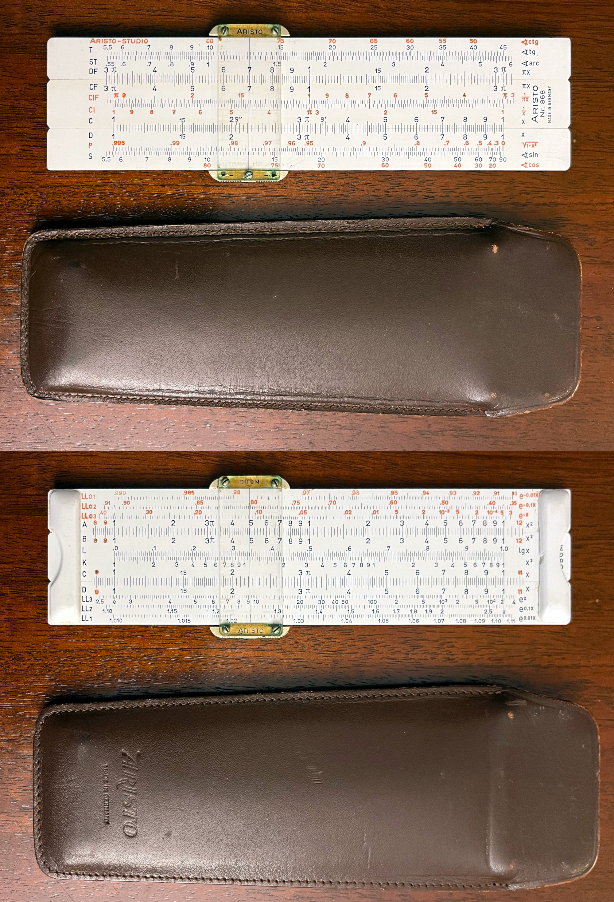

I was browsing Ebay and found this rule at a good price, so I ordered it.
I like Aristo rules’ design and layout, so this rule is a fun “compare and contrast” to my [Pickett Model 600](#pickett600) and [Aristo 867U Darmstadt](#aristo867u).

* Purchased July 7, 2023
    * Ebay
    * $29.78 Shipped
    * Arrived July 14, 2023
* Scales:
    * Front: LL01, LL02, LL03, A [ B, L, K, C ] D, LL3, LL2, LL1
    * Back: T, ST, DF [ CF, CIF, CI, C ] D, P, S
* Cursor
    * Multiple hairlines: PS, KW, “36”, π/4
    * The cursor is installed upside-down:
    The “Aristo” logotype on the cursor bar is upside-down.
    The “kW” and “HP” marks are over C and D scales instead of A and B scales
    * Cursor screws covered in some sort of “gunge”.
    That cleaned up with a spudger.
    * I need to figure out how to remove the cursor so I can clean it and turn it over.
        * **Update:** I disassembled the cursor and washed it, and the rest of the rule, with mild dish soap and water.
        The “36” cursor mark washed away partially and is faint now.
        The mark is visible, and the cursor is oriented correctly now.
* Includes Leather Case
* Manufacturing Code Stamp “6013”
    * Oughtred Society Journal Article: [DENNERT & PAPE and ARISTO Slide Rules 1872 - 1978](https://osgalleries.org/journal/displayarticle.cgi?match=6.1/V6.1P4.pdf)
    * 1960, Lot 13
    * The “13” appears to be double-stamped. The “60” is harder to read.
    * An Aristo rule manufactured in 1960 ought to have an alphanumeric code, according to the JOS article linked above.
    Maybe I have read this incorrectly.
* Good Condition
    * “Gutmann H.” engraved between “75” and 80 marks on S scale.
    * “GH” engraved on edge of rule opposite Manufacturing Code.
* Includes Leather Case
    * Case in Good Condition

[Return to Top](#top)

-----

## Pickett Model N700-T A-2
### "U. S. AIR FORCE AERIAL PHOTO SLIDE RULE TYPE A-2"
### [Pickett Page on ISRM](https://www.sliderulemuseum.com/Pickett.htm)

I had been meaning to order one of these “New In Box” Pickett Model N700-T rules from Sphere Research Slide Rule Universe for some time.
I probably didn't need another Model 700, but the 700 was the lowest-price “New In Box” Pickett at the Slide Rule Universe, and I really like the 700.
It came to my attention that Sphere Research was planning to close down by the end of the year, so I placed my order.

When it arrived, I was pleased at the excellent condition of the box and its contents.
The rule was in a plastic sleeve inside its leather case, and there was something sticky sticking the sleeve to the rule.
I peeled the sleeve off the rule, which left sticky residue on the “Front” of the rule, but not on the back.
I washed the rule with Dawn dish soap and water, and that removed the residue from the face of the rule and the sliding surfaces.
Now it is good as new!

I was surprised to see the slide tension springs.
I have a good assortment of Pickett pocket rules, and none of my others have the tension springs.
I was beginning to believe that none of Pickett’s pocket rules came with the tension springs, but here they are.
I have seen pictures on ISRM of Pickett pocket rules with cutouts on the rails that would seem to accommodate tension springs, but I wasn't sure that’s what the cutouts were for.
Now I know.

I was also glad to see this rule has a “Style 5” logo, since I didn't have any examples of that.

So, I have another Pickett Model 700, and I paid more for it than I usually like to pay for a rule.
However, with its features and its condition, I’m glad I got it.

* Purchased September 6, 2023
    * Sphere Research Slide Rule Universe
    * $75 Shipped
* [Manual on ISRM](https://www.sliderulemuseum.com/Manuals/M184_P232_Pickett_USAF_AerialPhoto_M520-700.pdf)
* Manufactured 1962-1964
    * Aluminum
        * Shiny edges, not corroded or dark
    * Documentation states that Aerial Photo Slide Rule is "Front" and Slide Rule Scales are "Reverse"
    * Scales:
        * Front: Ground Size (Feet), Image Size (CM, FT), Focal Length (Inches), Altitude (Feet)
        * Rear: L, A DF [ CF, CIF, T, S, C ] D, DI, K
    * Logo Style 5
        * No Artwork Mark
    * Stamped Aluminum Contoured Posts
    * Grooved Convex Lens
    * Nylon Cursor Bars
    * No Grooves in Rails for Cursor
    * Grooved Slide
    * Slide Tension Springs
* Includes Case with Conversions and Formulas and Pocket Clip
    * Pull Tab to remove rule from case
    * Pull Tab has Style 6 Logo
* Includes Original Box
* Includes Instruction Manual
* New-In-Box condition.

[Return to Top](#top)

---

## Post 1447

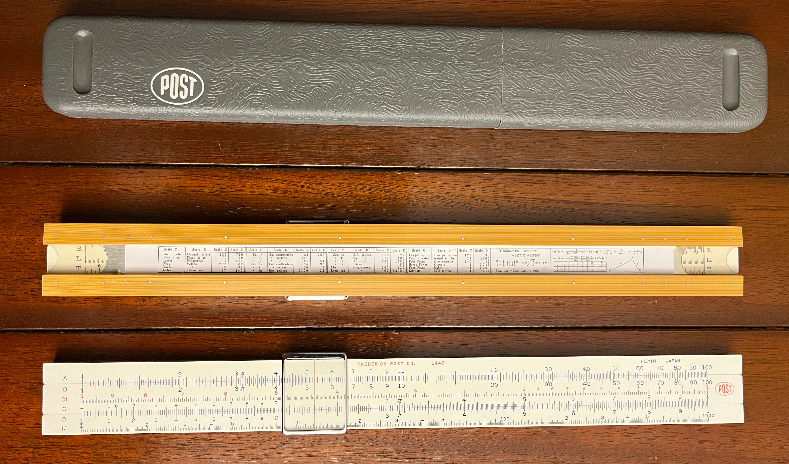

* A gift from Aly on October 3, 2023
* Manufactured March 1968
    * Date Code SC
* [Manual on ISRM](https://www.sliderulemuseum.com/Manuals/M226_Post_SR_Inst_1441-1444-1447-1452.pdf)
* Scales:
    * Front: A [ B, CI, C ] D, K
    * Rear of Slide: [ S, L, T ]
    * Rear of Body: Equivalents Table, Law of Sines
    * Same as [K&E N4058W Beginner’s Slide Rule](#ke4058)
* Excellent condition
    * Same scales and audience as K&E N4058W, but MUCH nicer!
    * Smooth operation
    * Really nice rule!
* Includes plastic case

[Return to Top](#top)

---

## Halden Calculex
### [Halden Calculex on ISRM](https://www.sliderulemuseum.com/PocketWatch.shtml#Halden)
### [This page on “Bob’s Calculators and Slide Rules”](https://sites.google.com/site/bobscalculatorsandsliderules/home/slide-rules/halden) shows restoration of a Halden Calculex

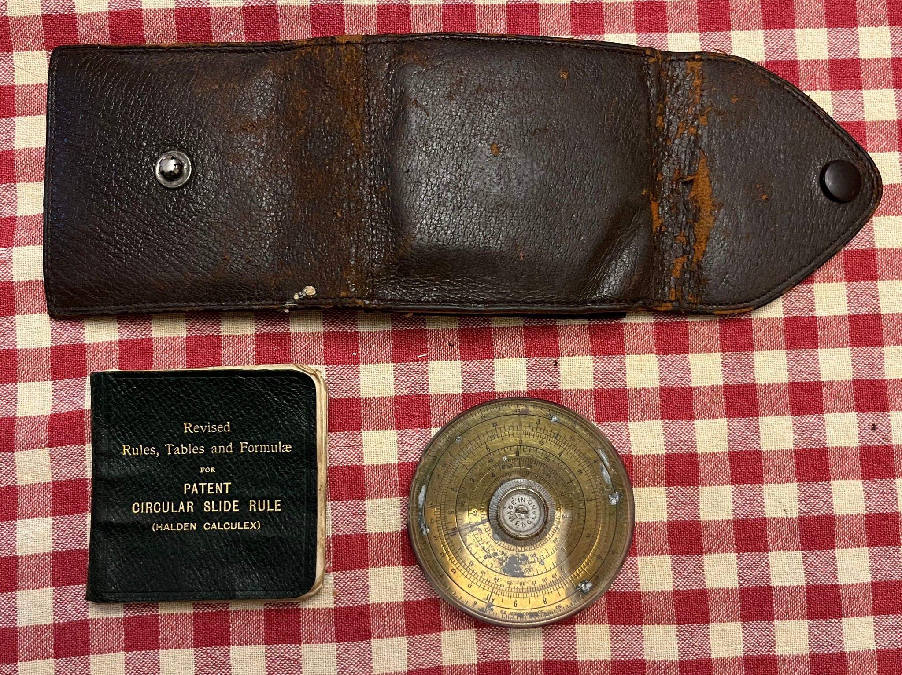

Alyssa got this for me!
This is a very nice little circular rule that has suffered some sort of catastrophe in its life.
It is missing its metal outer ring and handle, and one of its two glass pieces.
The scales look like they may be tarnished.
The rivets seem to be showing through the faces of the outer scales.
However, the inner and outer scales move easily, as does the glass.

I think I could make a replacement glass with a hairline out of Plexiglas if I can find the correct thickness.
The outer ring and handle would be more of a challenge.

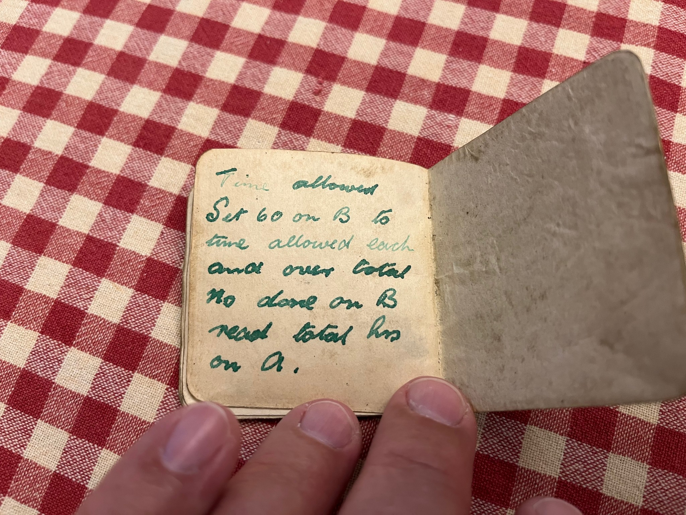
Maybe the best part of this is the tiny leather-bound instruction manual.
The manual is well-written, with lots of operation examples and reference tables.
They packed a lot of information on its 94 tiny pages.
The last page, originally blank, has handwritten notes for “Time allowed”, apparently for the number of hours to complete X operations at Y minutes each.
The note appears to have been written with a fountain pen with green ink.
The manual has no copyright date.

* Lys got me this!
* Rough condition
    * Missing outer ring and handle
    * Missing Front glass
    * Intact Rear glass
    * Glass and Inner and Outer move easily, with occasional roughness
* Includes leather case 
    * Nice soft leather folding case with snap
* Includes instruction book
    * Leather bound tiny instruction book
    * Handwritten notes on last page

[Return to Top](#top)

---

## Pickett Model 800-T
### "MODEL 800-T LOG LOG SYNCHRO-SCALE"
### [Pickett Page on ISRM](https://www.sliderulemuseum.com/Pickett.htm)
### 

* Purchased June 5, 2024
    * Ebay
    * $32.95 Shipped
    * Arrived June 10, 2024
* [Manual on ISRM](https://www.sliderulemuseum.com/Manuals/ISRM_M329_Pickett_HowToUseLogLogSlideRules_N800-N803-N300-N600-N4_EdMillis.pdf)
* [Pickett Metal Slide Rules Chronology](https://osgalleries.org/journal/displayarticle.cgi?match=1.1/V1.1P5.pdf)
* Manufactured 1958 - 1960
    * Aluminum
        * Shiny edges, not corroded or dark
    * Front of Slide:
        * Logo Style 4
        * “MODEL 800-T LOG LOG”
        * “SYNCHRO-SCALE”
        * Artwork Mark 105
    * Back of Slide:
        * “PATENTS APPLIED FOR”
        * “PICKETT & ECKEL, INC. CHICAGO”
        * Artwork Mark 108
    * Scales:
        * Front: LL1+0.01/-0.01, A [ B, ST, T 0., Cot <10.0, S, Cos, C ] D, DI, K
        * Rear: LL2+0.1/-0.1, DF [ CF, CIF, L, CI, C ] D, LL3+1.0/-1.0
        * Descending values on CI, CIF, trig, and reciprocal log-log scales in red with right-pointing arrow
    * Stamped Aluminum Posts
        * "Grooved Stamped Posts Contoured to Finger Tip"
    * Grooved Flat Lens
    * Nylon Cursor Bars
    * No Grooves in Rails for Cursor
    * Grooved Slide
    * Slide Tension Springs
* Includes Case with plastic insert
    * “Bill Todd” stamped inside flap
    * Appears that the case used to have a "DYMO Embosser" label applied. Cannot read what it said, but I would guess “Bill Todd”.
* Excellent Condition

[Return to Top](#top)

---

## Dietzgen Redirule 1776

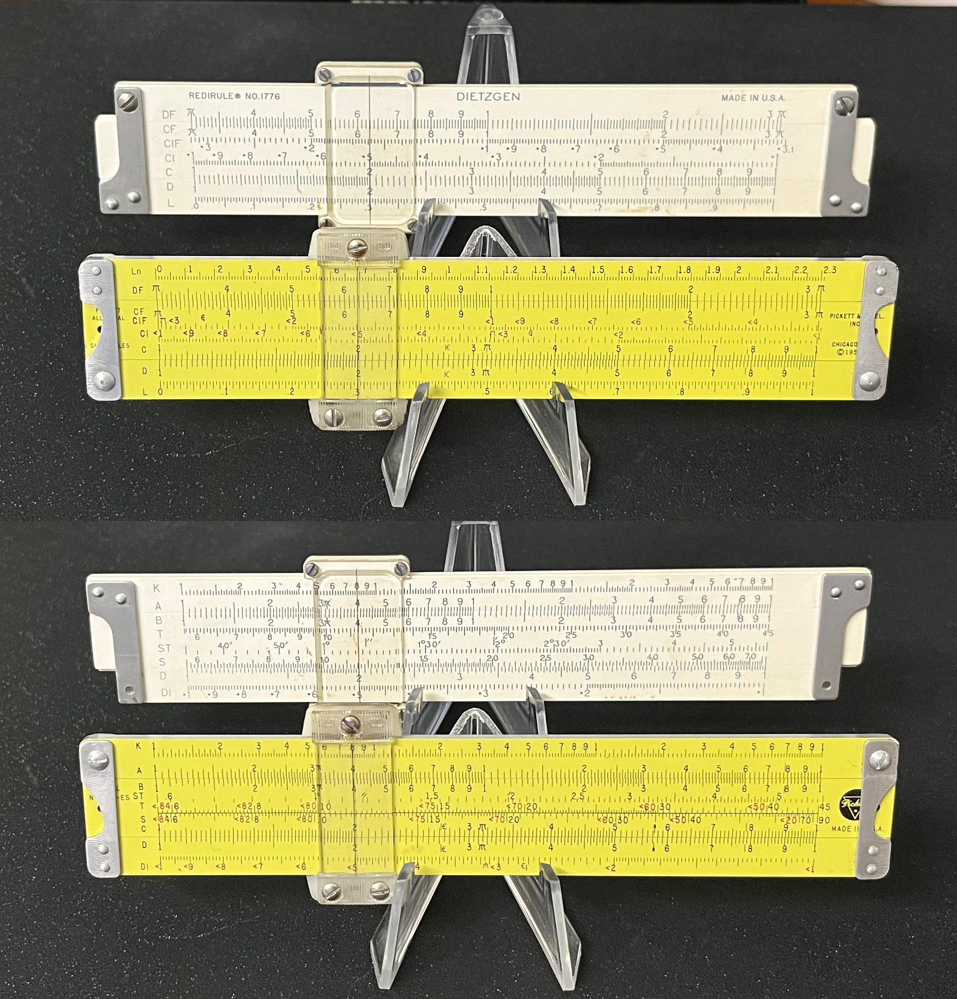

* Purchased August 7, 2024
    * Adopted from ISRM
    * $45 Donation includes shipping
    * Arrived August 13, 2024
    * Included UTO No. 601
* Manufactured Early 1970s
    * [Dietzgen Catalog Matrix (ISRM)](https://www.sliderulemuseum.com/Manuals/Dietzgen_CatalogMatrix_BruceBabcock1996_3pgs.pdf)
    * Scales:
        * Front: K, A [ B, T, ST, S ] D, DI
        * Rear: DF [ CF, CIF, CI, C ] D, L
* Includes leather case
    * Metal clip, grommet, and stamped “Dietzgen” logo on back.
* Excellent Condition

[Return to Top](#top)

---

## UTO No. 601

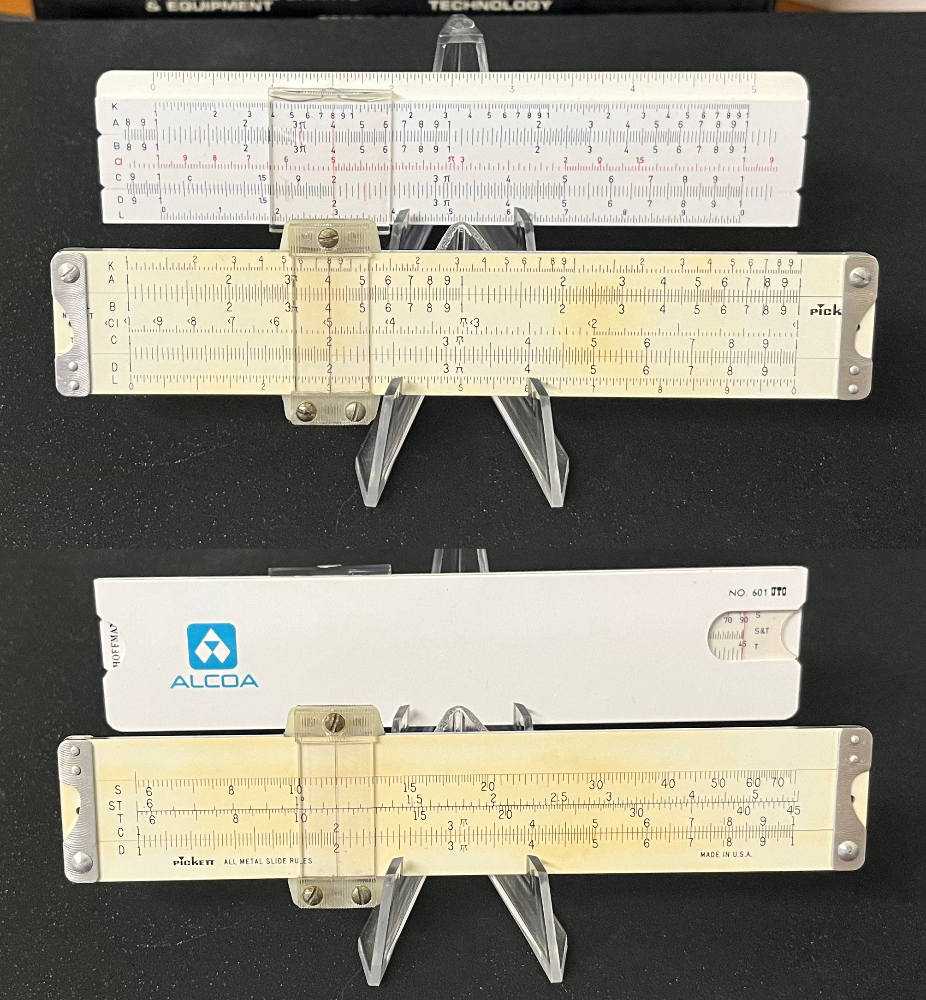

Mike Konshak included this with the Dietzgen 1776 I adopted from ISRM.
The 601 is a nice Reitz rule that I would compare to a Pickett 200.
I had been considering getting one of these, so I was glad to see it!

* Arrived August 13, 2024
    * From ISRM
    * 20.04.01.071.X - Hoffman UTO 601 Rietz ALCO promo - to duplicates gift
    * Included with [Dietzgen Redirule 1776](#dietzgen1776)
* I don’t know when it was manufactured
* Scales
    * Front: K, A [ B, CI, C ] D, L
    * Rear: [ S, S&T, T ]
* Includes leather case
    * “Made in Denmark” printed on front
    * ALCOA logo printed on back
* Includes one-sheet instructions for UTO Reitz, Darmstadt, and Electro rules
* Excellent Condition

[Return to Top](#top)

---

## Pickett Model 903

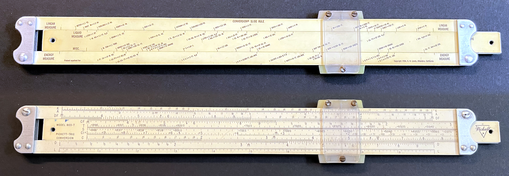

One day, I joined the ISRM Google Meet video call.
I met Mike Konshak, George, and Mike (If I recall correctly, it was Mike Syphers of [Following the Rules](https://followingtherules.info/)), and we had a fun chat about slide rules, home ownership, motorcycles, and other topics.
We started to talk about replacement parts for Pickett rules, and Mike K showed a Pickett 903 he had that needed a cursor.
He showed us replacing its cursor with the cursor from a different, later Pickett, and called it a “Frankenrule”.
He also demonstrated adding a hairline to a Plexiglas reproduction cursor glass he had cut and drilled earlier to match early Pickett pocket rules.
Since he had just sent me the Dietzgen and UTO recently, he had my address, so he sent me the “Frankenrule” and the reproduction cursor glass he had just marked.

This was a nice, unexpected gift!
The 903 was not on my radar, but it's a nice compare-and-contrast to my 902, and to the “rear” of the 700/520.

* Arrived September 3, 2024
    * Gift from Mike Konshak, ISRM
* Manufactured 1954-1955
    * Aluminum
    * “Period 2”
    * Scales:
        * Front: K, A, DF [ CF, T Cot, S Cos, CI, C ] D, L
        * Rear: Unit Conversion Gauge Marks
            * [Like this unusual 903 on ISRM](https://www.sliderulemuseum.com/Pickett/Pickett_903-T_TrigConversion_TriangleLogo_RoundedBraces_EdMillisCollection.jpg)
            * “Copyright 1954, C. H. Lynch, Alhambra, California”
            * Most other 903s have “Equivalents and Instructions”, more like a [Model 902](#pickett902), but not exactly.
    * Logo Style 3
        * “47” Above Logo
    * Stamped Aluminum Posts
        * “Smooth Stamped Posts Contoured to Finger Tip”
    * Grooved Rails for Cursor
    * Not Original Cursor:
        * Grooved Flat Lens
        * Extended Nylon Cursor Bars
        * The original cursor would have been the four-screw Plain Flat Lens with Machined Metal Cursor Bars
    * No Slide Tension Springs
* Includes a homemade white fabric case
* Good Condition

[Return to Top](#top)

---

## Aristo 0968 Studio

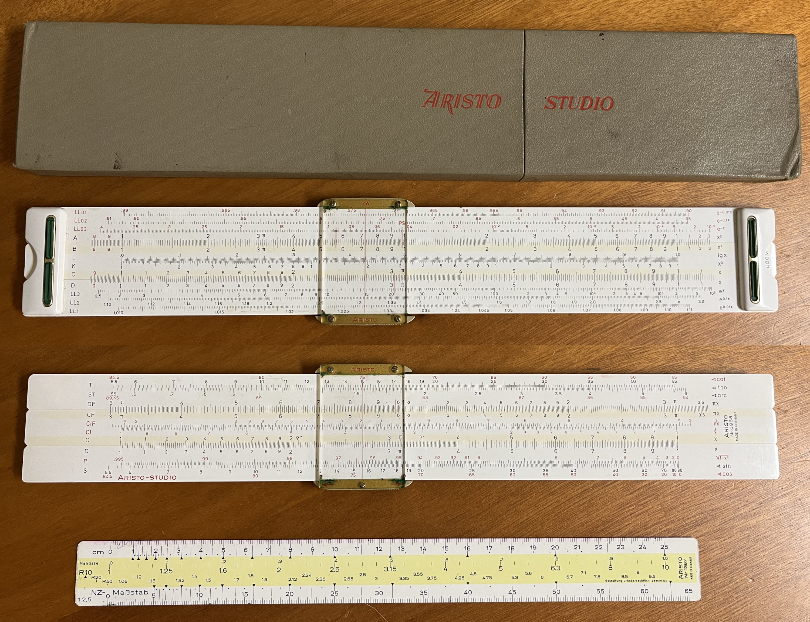

Alyssa got me this and the 0903 below for my birthday!

I have been wanting a full-size Studio.
This one is very nice.
It has a substantial feel to it, and the slide and cursor move SO smoothly!
This is a very pleasant slide rule to use.

This 0968 is a great companion to my 868 Studio, and the pair complement my Pickett [Model 800](#pickett800T) and [Model 600](#pickett600) pair well.

* Received on March 15, 2025
* Scales:
    * Front: LL01, LL02, LL03, A [ B, L, K, C ] D, LL3, LL2, LL1
    * Back: T, ST, DF [ CF, CIF, CI, C ] D, P, S
* Cursor
    * Multiple hairlines: PS, KW, “36”, π/4
* Manufacturing Code Stamp “6249”
    * Oughtred Society Journal Article: [DENNERT & PAPE and ARISTO Slide Rules 1872 - 1978](https://osgalleries.org/journal/displayarticle.cgi?match=6.1/V6.1P4.pdf)
    * 1962, Lot 49
* Excellent Condition
* Includes Cardboard Box
    * Good condition
* Includes Nr. 1367 “NZ Scale” Insert
    * Good condition, with some ink marks on it.

[Return to Top](#top)

---

## Aristo 0903 Scholar

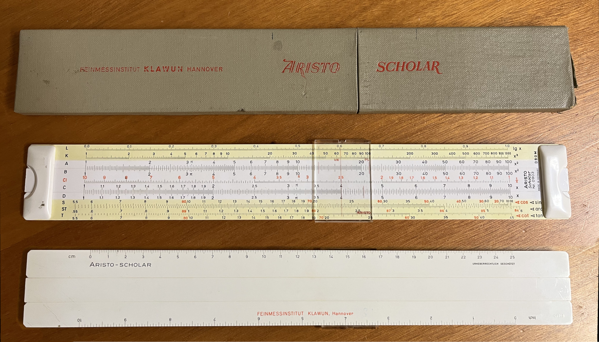

Alyssa got me this and the 0968 above for my birthday!

This is a nice student rule with interesting branding applied.

FEINMESSINSTITUT KLAWUN sold precision measuring and calculating devices, including watches and slide rules.
They made their own slide rules, but also resold other German slide rules: Aristo, Faber-Castell, Nestler.

* [Manual on ISRM](https://www.sliderulemuseum.com/Manuals/ISRM_M316_Aristo_Scholar_0903LL_VS-2_GiftOfEdwardWright.pdf)
* Scales:
    * Front: L, K, A [ B, CI, C ] D, S, ST, T
    * Rear: 25cm [ ] 10 inch
* “FEINMESSINSTITUT KLAWUN, Hannover” printed on back
    * According to [this JOS article](http://osgalleries.org/journal/displayarticle.cgi?match=15.1/V15.1P12.pdf), Klawun resold Aristo slide rules with their own branding added.
* “S. H.” written on back, faded
* Flat Plastic Cursor
* Manufactured Code “G5948”
    * 1959
    * Geretsried
    * Lot 48
* Includes Cardboard Box
    * “ARISTO SCHOLAR” Printed on front of box
    * “FEINMESSINSTITUT KLAWUN, HANNOVER” Printed on front of box
    * “S. HEZEL” hand-embossed/written on back of box
* Excellent Condition

[Return to Top](#top)

---

## Sterling Pocket Metric Converter

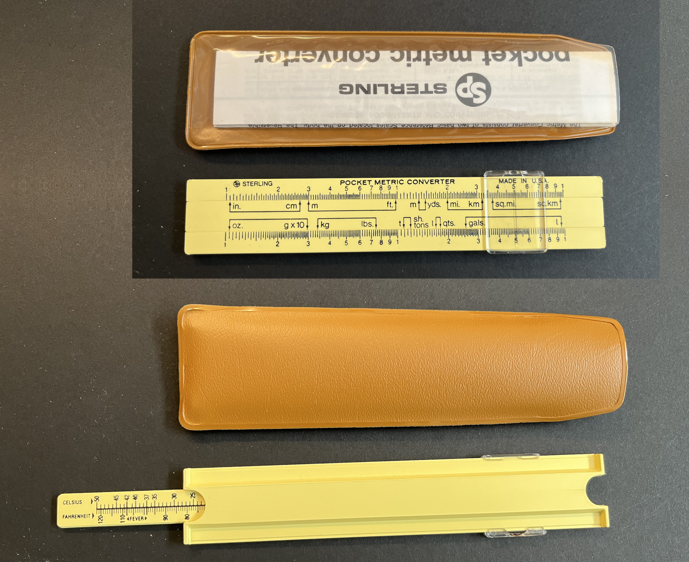

* Alyssa got this for me!

[Return to Top](#top)

---

## Ole Jorgensen Slide Rule Pencil Cup

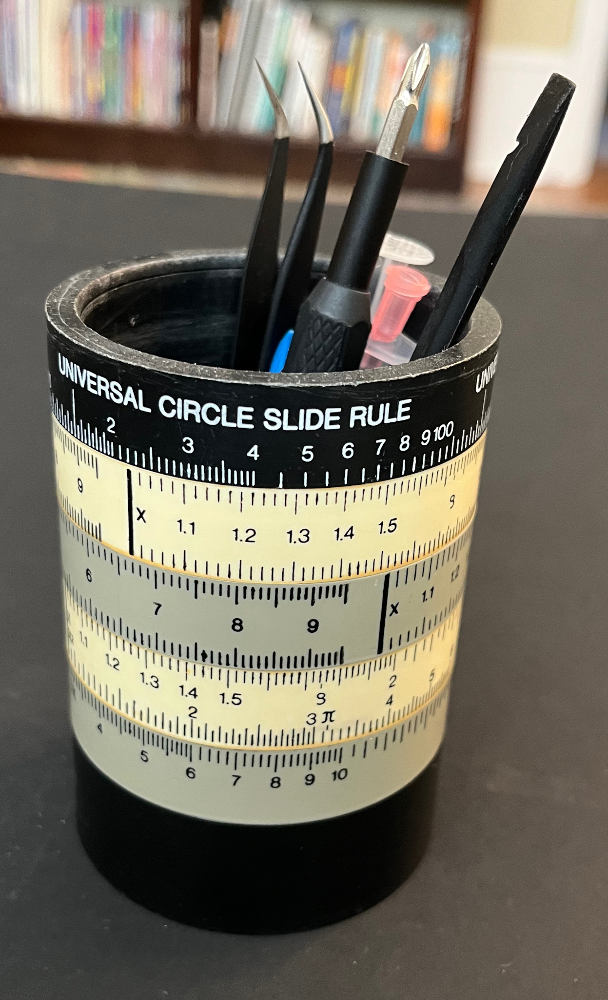

* Ordered from Ebay July 1, 2025
    * Delivered July 12, 2025

---

## Kitchen Slide Rule

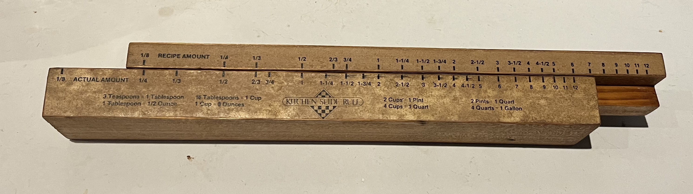

* Ordered from Ebay July 4, 2025
    * Delivered July 9, 2025

[Return to Top](#top)

---

## Post Versalog

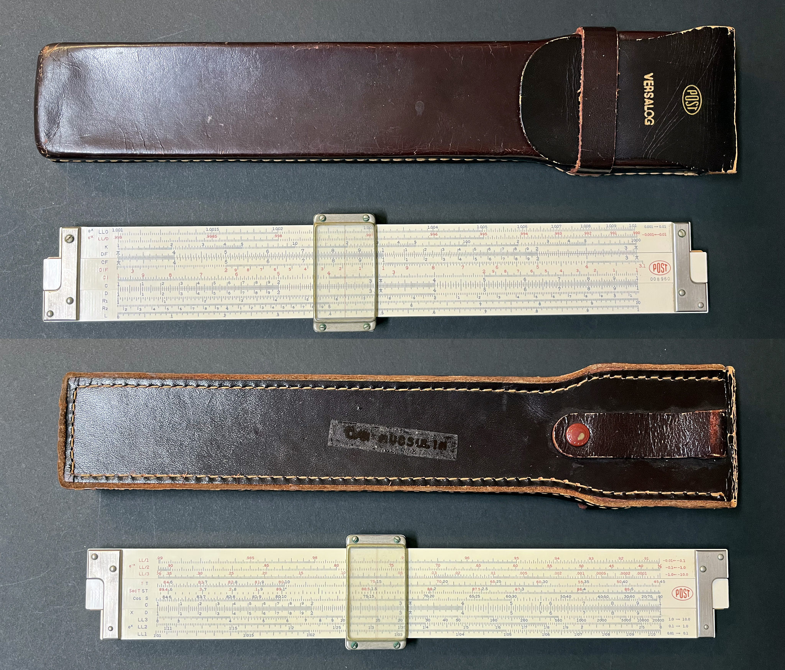

Alyssa got me this!

* Scales:
    * Front: LL/1, LL/2, LL/3 [ T/T, SecT/ST, Cos/S, C ] D, LL3, LL2, LL1
    * Rear: LL0, LL/0, K, DF [ CF, CIF, CI, C ] D, R1, R2, L
* Cursor
* Date Code Stamp: JF, Manufactured in June of 1959, a “Versalog 1A”
* Serial Number: 008960
* Excellent Condition
* Includes Leather Case
    * Case includes belt loop
    * Brown case has gold color where the flap closes?
    * Used to have a Dymo Embosser Label on back: “Dan Musselin” ?

[Return to Top](#top)

---

## K & E 4092-3

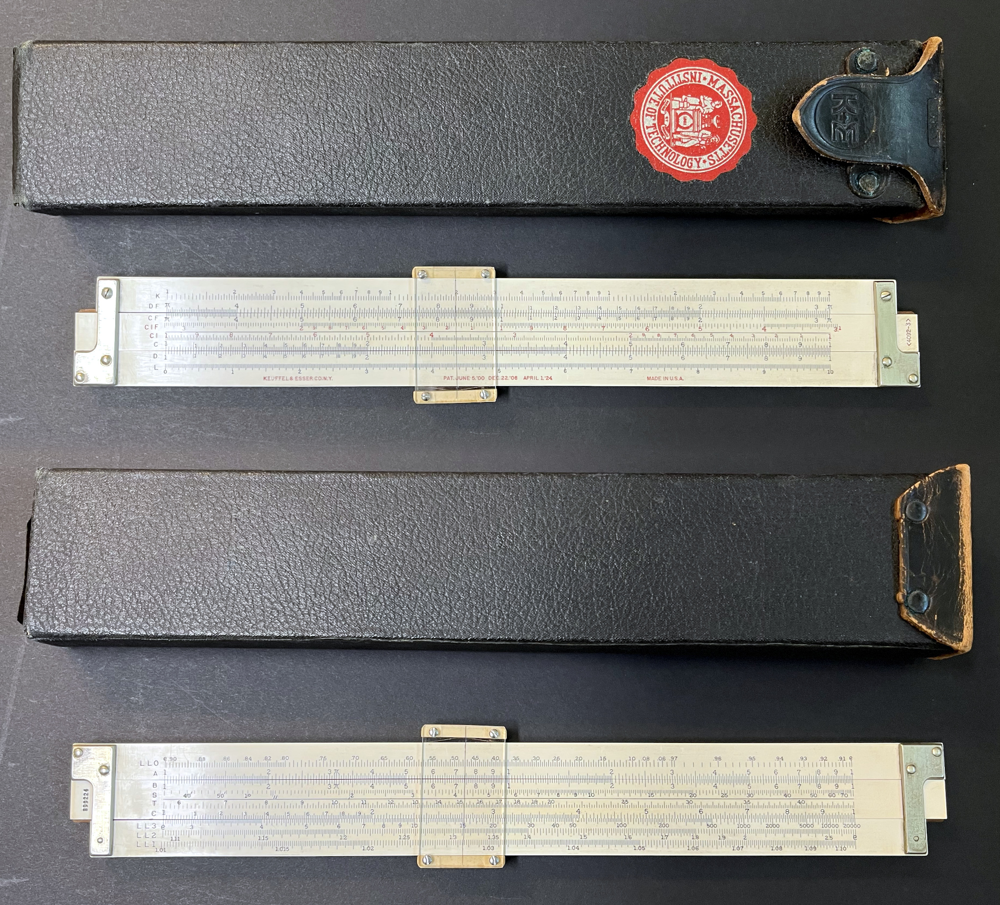

This is an interesting older-style Log-Log rule.
It has one LL0 scale for e^-x, indexed to A. 
LL0 is folded so that e^-3 and e^-0.03 correspond to 30 on the A scale.

Its S scale is in DMS (“TrigInMinutes”, instead of “DeciTrig”), and is also indexed to A.

* Purchased July 23, 2025
    * Adopted from ISRM
    * 2014.01.07.02.X - K&E_Standard - Added 4092-3 sn399224 (1932)w/helvetica font scale labels. All glass cursor ISRM Lens.
    * I had asked for 23.03.01.03, but Mike K substituted this one. I’m all right with that!
    * Arrived July 26, 2025
* Manufactured 1932
* Excellent Condition
    * There is a slight twist in the frame, but it doesn’t seem to affect the operation.
* Scales:
    * Front: LL0, A [ B, S, T, C ] LL3, LL2, LL1
    * Rear: K, DF [ CF, CIF, CI, C ] D, L
* Cursor:
    * “All Glass” cursor
    * Reproduction glass on at least one side; a hairline is scribed and inked, but it isn't straight. I may get another glass from ISRM and try to scribe a line myself.
    * Original cursor blocks
* Includes leather (& cardboard?) case
    * Good condition
    * Case has MIT decal
    * Case has Model 4081-3

[Return to Top](#top)

---

## Dietzgen Redirule 1771

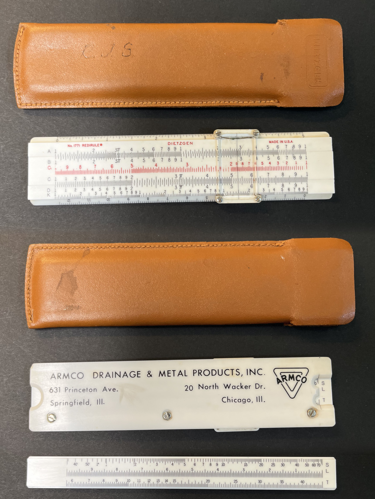

Mike Konshak included this with the [K & E 4092-3](ke4092) I adopted from ISRM.

* Scales:
    * Front Scale: 5 inch // A [ B, CI, C ] D, K \\ 12.5 cm
    * Rear Slider: [S, L, T ]
* Includes Brown Leather case
    * Good condition
    * “R. J. S.” written on case

[Return to Top](#top)

---

## Vernon Sterling Slide Rule Tie Bar

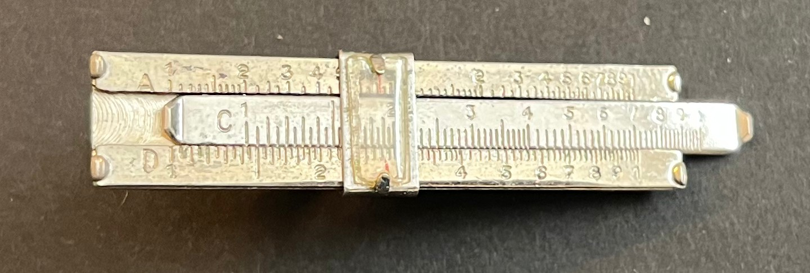

I was getting ready to go to a wedding, so I would be be wearing a suit and tie for the first time in a long time. We went and bought the suit and tie, and I thought, “It's too bad I don't have one of those neat little slide rule tie bars to go with this.”

A couple minutes later, I was browsing eBay.

A couple minutes and thirty dollars later, I had placed an order.

A couple days later, I had a beautiful tiny slide rule tie bar!

The slide and cursor slide, the cursor has a faint hairline printed on it, and it has A, C, and D scales! It’s only good for one or two significant digits, but it works!

[Return to Top](#top)

---

## Pickett N803-T

This was a Hanukkah gift from Ben!

* Received on December 17, 2025.
* Manufactured 1962 - 1966
    * Aluminum
        * Shiny edges, not corroded or dark
    * Front of Slide:
        * “MODEL N803-T LOG LOG”
        * “SPEED RULE”
        * “DUAL BASE”
        * “Negative” of Logo Style 4
        * “SYNCHRO-SCALE”
        * Artwork Mark 109
    * Back of Slide:
        * “PATENTS APPLIED FOR”
        * “PICKETT & ECKEL, INC. CHICAGO”
        * Artwork Mark 110
    * Scales:
        * Front: LL0+0.001/-0.001, LL1+0.01/-0.01, DF [ CF, CIF, L, CI, C ] D, LL2+0.1/-0.1, LL3+1.0/-1.0
        * Rear: √ #1, √ #2, K, A [ B, S Cos, ST, T Cot, CI, C ] D, DI, DFₘ
        * Descending values on CI, CIF, trig, and reciprocal log-log scales in red with right-pointing arrow
        * The scales are faint in places, like they have been rubbed off. Red text seems less rubbed off than black.
    * Stamped Aluminum Posts
        * "Grooved Stamped Posts Contoured to Finger Tip"
    * Grooved Convex Lens
    * Nylon Cursor Bars
    * No Grooves in Rails for Cursor
    * Grooved Slide
    * Slide Tension Springs
    * Includes Original Box
        * Price Tag: “DYKEMA OFFICE SUPPLY 21.50”
    * Good condition

[Return to Top](#top)

---

# Wish List

My “Wish List” keeps getting shorter!

---

## Log-Log Rules

### Pickett Model Log-Log Rules

The Pickett [Model 500](#pickett500), [Model 800](#pickett800T), [Model 803](#pickettn803t), Model 2, Model 3, and [Model 4](#pickettn4) seem to make up a “spectrum” of Log-Log rules.
I probably don’t need ALL of them in my collection.
Yet, I am strangely compelled…

Also, an N3P or an N4P would be great, but are harder to come by.

### Aristo Studio 968

I enjoy the nice graphic design of Aristo slide rules.
I also like Aristo’s scale layout, with the trig scales on the body, and the addition of a P scale.

**Update:** I now have an [868 Studio](#aristo868) and an [0968 Studio](#aristo0968)!

### Nestler 0130 MultiMath
### Post Versalog

Lys got me a lovely [Post Versalog](#postversalog)!

### K&E Log-Log Rules

I have lumped the K&E rules together because there are a lot of K&E Log-Log rules, and I am not well-versed in the differences between all of them.
The 4081-3s seem to be the “classic” K&E Log-Log rules.
I like the 4181-1 pocket-size Log-Log rules.
The 68-1100 “Deci-Lon” seems to be the flagship, like the [Pickett N4](#pickettn4).

I have started by adopting a [K & E 4092-3](#ke4092), which is an earlier-style Log-Log rule, with one LL0 scale indexed to A.

## Misc

### Pickett Model 1010SL

The Pickett Model 1010 is a nice trig rule.
It appears to be an evolution of the [Model 1000](#pickett1000).
The 1010SL looks like the model 1010, but with Square Root scales in addition to the A and B scales.
I don’t think I need a 1000 and a 1010, but the 1010SL is an interesting enough variation that I’d like one.

---

## Circular Slide Rules

### Concise Model 300

    Concise 300 on International Slide Rule Museum

A nice circular Log-Log rule, in Concise’s nice style.

* Scales
    * Front Scale: K, A, D ( C, CI, B, L )
    * Back Scale: LL3, LL2, D ( C, S Cos, T1 Cot1, T2 Cot2, ST )

[Return to Top](#top)

---

### Concise Model 270

    Concise 270 on International Slide Rule Museum

* Scales:
    * Front Scale: L, D ( C, CI, A, K )
    * Back Scale: DI, D ( S, T1, T2, ST )

---

### Concise Model 271

    Concise 271 on International Slide Rule Museum

* Scales
    * Front Scale: L, D ( C, CI, A, K )
    * Back Scale: DI, D ( S Cos, T1 Cot1, T2 Cot2, ST )

[Return to Top](#top)

